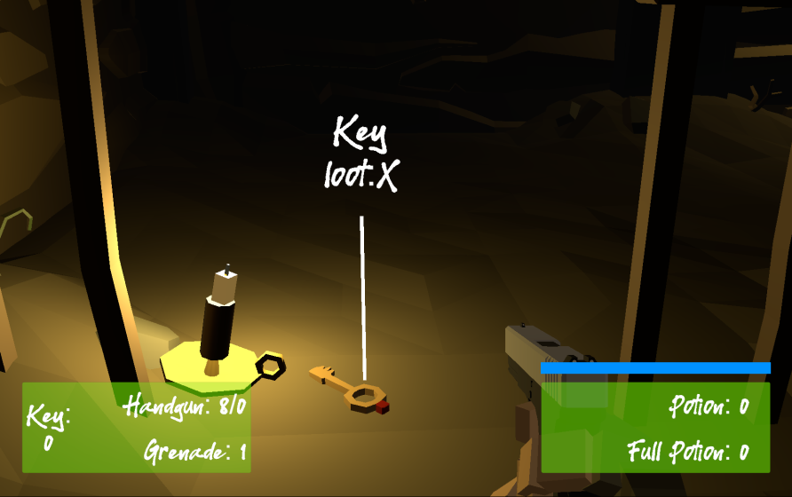

## _**Little Big Tips**_  > Pattern / Algorithm > command pattern

Feel free to try this behaviour on the playable demonstration / prototype: [The Dungeon](https://simmer.io/@alissin/the-dungeon).

_Note_: The purpose of this demonstration is to evaluate this gameplay mechanic. The FPS shooter gameplay mechanic itself, the scenario and the props are free assets from the Asset Store.

> 

#### Problem description
Sometimes, the Player wants to change the controls in runtime. So, how to make this change fast and dynamic?

#### Solution simplified concept
With the _command_ pattern, we are able to decoupling the button (or the key of the keyboard) and the method call (the Player action in this case). In other words, the button itself doesn't call directly the method anymore. A new class or "layer" between both will be responsible for it and each command is implemented in an individual and separated class.

#### Solution suggestion
In this case, our player has a lot of actions.<br/>
_Note_: To keep this example simple, we will map only 4 actions to use our command pattern: UseKnife, Reload, Loot and Interact. After that, you will get the idea and will be able to implement the other actions with no problem.

In the hierarchy, create 2 game objects and name them as `Player` and `Input Handler`:

```
Hierarchy:
- Player
- Input Handler
```

Create a C# script `Player.cs` and attach this script to the `Player` game object:

```csharp
public class Player : MonoBehaviour
{
    ...
```

Create a C# script `InputHandler.cs` and attach this script to the `Input Handler` game object:

```csharp
public class InputHandler : MonoBehaviour
{
    ...
```

Create another C# script `ICommand.cs`. This will be our interface which each command (class) will implement:

```csharp
public interface ICommand
{
    void Execute(Player player);
}
```

Create the class of each command and implement the `ICommand.cs` interface. You can use the same file if you wat (`ICommand.cs`):

```csharp
public interface ICommand
{
    ...
}

public class UseKnifeCommand : ICommand
{
    public void Execute(Player player)
    {
        // TODO: impl.
    }
}

public class ReloadCommand : ICommand
{
    public void Execute(Player player)
    {
        // TODO: impl.
    }
}

public class LootCommand : ICommand
{
    public void Execute(Player player)
    {
        // TODO: impl.
    }
}

public class InteractCommand : ICommand
{
    public void Execute(Player player)
    {
        // TODO: impl.
    }
}
```

Now, let's make this work!

In the `Player.cs` script, implement the actions:

```csharp
public void UseKnife()
{
    Debug.Log("impl. the action use knife"); // TODO: remove
}

public void Reload()
{
    Debug.Log("impl. the action reload"); // TODO: remove
}

public void Loot()
{
    Debug.Log("impl. the action loot"); // TODO: remove
}

public void Interact()
{
    Debug.Log("impl. the action interact"); // TODO: remove
}
```

Now, let's finish our action classes:

```csharp
public class UseKnifeCommand : ICommand
{
    public void Execute(Player player)
    {
        player.UseKnife();
    }
}

public class ReloadCommand : ICommand
{
    public void Execute(Player player)
    {
        player.Reload();
    }
}

public class LootCommand : ICommand
{
    public void Execute(Player player)
    {
        player.Loot();
    }
}

public class InteractCommand : ICommand
{
    public void Execute(Player player)
    {
        player.Interact();
    }
}
```

As you can see, our `Player` has the specific action methods implemented and we have each related action (class) calling these specific methods.

Now, let's implement the "layer" between both, I mean, our `InputHandler.cs` and map the commands. First, define the fields:

```csharp
ICommand qCommand;
ICommand rCommand;
ICommand xCommand;
ICommand kCommand;

ICommand[] defaultCommands;

bool isDefaultCommands = true;
```

Start the process:

```csharp
void Start()
{
    defaultCommands = new ICommand[4];

    defaultCommands[0] = new UseKnifeCommand();
    defaultCommands[1] = new ReloadCommand();
    defaultCommands[2] = new LootCommand();
    defaultCommands[3] = new InteractCommand();

    qCommand = defaultCommands[0]; // use knife
    rCommand = defaultCommands[1]; // reload
    xCommand = defaultCommands[2]; // loot
    kCommand = defaultCommands[3]; // interact
}
```

Create the method that will handle the inputs:

```csharp
ICommand HandleInput()
{
    if (Input.GetKeyDown(KeyCode.Q))
    {
        return qCommand;
    }
    else if (Input.GetKeyDown(KeyCode.R))
    {
        return rCommand;
    }
    else if (Input.GetKeyDown(KeyCode.X))
    {
        return xCommand;
    }
    else if (Input.GetKeyDown(KeyCode.K))
    {
        return kCommand;
    }

    return null;
}
```

As you can see, in this case, the default commands are mapped like so:<br/>
Q -> UseKnife | R -> Reload |  X -> Loot | K -> Interact

Finally, let's handle our commands:

```csharp
void Update()
{
    ICommand command = HandleInput();
    // TODO: get access to the Player script
    command?.Execute(GameManager.Instance.Player);
}
```

_Note_: In this case, I'm using the [singleton pattern](../singleton) to access the `Player` script.

The `HandleInput()` method returns the command and we only need to call the `Execute()` method of it.

To see the commands changing in runtine, implement this final method and call it from wherever you want:

```csharp
public void ToggleInput()
{
    if (isDefaultCommands)
    {
        // alternative commands
        qCommand = defaultCommands[1]; // reload
        rCommand = defaultCommands[2]; // loot
        xCommand = defaultCommands[3]; // interact
        kCommand = defaultCommands[0]; // use knife
    }
    else
    {
        // default commands
        qCommand = defaultCommands[0]; // use knife
        rCommand = defaultCommands[1]; // reload
        xCommand = defaultCommands[2]; // loot
        kCommand = defaultCommands[3]; // interact
    }
    isDefaultCommands = !isDefaultCommands;
}
```

#### Scripts:
[Player.cs](./Player.cs), [ICommand.cs](./ICommand.cs), [InputHandler.cs](./InputHandler.cs)

Again, feel free to try the behaviour of this _**Little Big Tip**_ on [The Dungeon](https://simmer.io/@alissin/the-dungeon).

More _**Little Big Tips**_? Nice, [let's go](https://github.com/alissin/little-big-tips)!