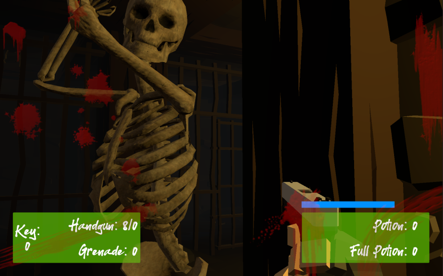

## _**Little Big Tips**_  > Pattern / Algorithm > component pattern

Feel free to try this behaviour on the playable demonstration / prototype: [The Dungeon](https://simmer.io/@alissin/the-dungeon).

_Note_: The purpose of this demonstration is to evaluate this gameplay mechanic. The FPS shooter gameplay mechanic itself, the scenario and the props are free assets from the Asset Store.

> 

#### Problem description
Given our main characters in our game, the Player and the Enemy, both have movement, attack, health and only the Enemy has armor:<br/>
- about the movement, each one has its own mechinics;
- about the attack and damage, they are based on a damage value. So, we can say that the attack mechanic is to hit the opponent, pass the attack value and subtract to the opponent's health and vice versa;
- about the damage mechanic itselt, the Player only worries about the health and the Enemy also has the armor to take care of;

Sometimes, this type of situation makes us think about to keep all the implementations together, something like a `Player.cs` script to control anything related to the Player and a `Enemy.cs` script to control anything related to the Enemy. But it's hard to mantain and definitely it's not a good idea.

Suppose that we have two scenarios, a production and a demonstration / prototyping scenarios and we would like to have different inputs of the player for each situation. Instead a simple `if` statement, we could use different components.

#### Solution simplified concept
It's a good practice to keep the things simple, clean and separeted. With the _component_ pattern, we start to think about to create each class (component) with its own responsability and as a bonus, we can reuse it wherever and whenever we want. For a team, it has its worth too because each one can work in an individual class and feature.

#### Solution suggestion
In our case, we could have the following classes (components):<br/>
`PlayerMovement.cs` -> to deal with the Player's movement (production scenario)<br/>
`DemostrationPlayerMovement.cs` -> to deal with the Player's movement (demonstration / prototyping scenario)<br/>
`EnemyMovement.cs` -> to deal with the Enemy's movement<br/>
`Attackable.cs` -> to deal with the attack of the both<br/>
`CollisionHandler.cs` -> to deal with the collision of the attacks<br/>
`PlayerDamageable.cs` -> to deal with the Player's taking damage<br/>
`EnemyDamageable.cs` -> to deal with the Enemy's taking damage

As you can see, the movement and the damage have its own classes (components). About the attack, we could reuse the code in the both: on Player attack (gun bullet) and on Enemy attack (arm hit). In general, the main idea here is to separate the things, each component has its own responsability and hence the code becomes more organized and easy to mantain.

In the hierarchy, create 2 game objects and name them as `Player` and `Enemy`. In this case, create a Cube and a Sphere and put them side by side in the scene (the Collider components will be useful later):

```
Hierarchy:
- Player
- Enemy
```

Create a C# script `PlayerMovement.cs` and attach this script to the `Player` game object:

```csharp
public class PlayerMovement : MonoBehaviour
{
    void Update()
    {
        // TODO: impl. the Player movement
    }
}
```

Create a C# script `EnemyMovement.cs` and attach this script to the `Enemy` game object:

```csharp
public class EnemyMovement : MonoBehaviour
{
    void Update()
    {
        // TODO: impl. the Enemy movement
    }
}
```

_Note_: To keep this example simple and focused on the component mechanism, it's up to you to implement the movement mechanics.

Let's create the damage component. First, create a C# script `IDamageable.cs`. This will be our interface which we will implement our damage:

```csharp
public interface IDamageable
{
    void OnTakeDamage(float amount);
}
```

Let's create the attack component. Again, create a C# script `IAttackable.cs`. This will be our interface which we will implement our attack:

```csharp
public interface IAttackable
{
    void OnAttack(IDamageable damageable);
}
```

Now, we can create our reusable attack:<br/>
_Note:_ In this case, I'm using the [flyweight pattern](../flyweight) to encapsulate the attack.

```csharp
public class Attackable : MonoBehaviour, IAttackable
{
    [SerializeField]
    AttackSO attack; // TODO: impl. the AttackSO Scriptable Object

    public void OnAttack(IDamageable damageable)
    {
        damageable.OnTakeDamage(attack.baseDamage);
    }
}
```

Create the attack (`AttackSO`) of the `Player` and the attack of the `Enemy`.<br/>
_Note:_ Again, in this case, I'm using the [flyweight pattern](../flyweight) to create these Scriptable Objects.

Attach the `Attackble.cs` to the `Player` and in the inspector, attach the `AttackSO`. Do the same for the `Enemy`.

As you can see, now we have the movement and the attack logics in separeted components and as a bonus, we are reusing the `Attackable` component.

Let's move on and create another component that will be responsible for the collisions. Again, we will reuse the same component for both, the `Player` and the `Enemy`. Don't forget to attach the `CollisionHandler.cs` to these game objects:

```csharp
public class CollisionHandler : MonoBehaviour
{
    void OnCollisionEnter(Collision collision)
    {
        IAttackable attackable = GetComponent<IAttackable>();
        if (attackable != null)
        {
            IDamageable damageable = collision.gameObject.GetComponent<IDamageable>();

            if (damageable != null)
            {
                attackable.OnAttack(damageable);
            }
        }
    }
}
```

Let's create the damage component of the `Player`. Don't forget to attach the `PlayerDamageable.cs` to the `Player` game object:

```csharp
public class PlayerDamageable : MonoBehaviour, IDamageable
{
    float health = 50.0f;

    public void OnTakeDamage(float amount) 
    {
        if (health >= Mathf.Epsilon)
        {
            health -= amount;
        }
        else
        {
            // TODO: death
        }
        Debug.Log("player taking damage..."); // TODO: remove
    }
}
```

Do the same to the `Enemy` and don't forget to attach the `EnemyDamageable.cs` to it:

```csharp
public class EnemyDamageable : MonoBehaviour, IDamageable
{
    float armor = 5.0f;
    float health = 10.0f;

    public void OnTakeDamage(float amount)
    {
        if (armor >= Mathf.Epsilon) {
            armor -= amount;
        }
        else if (health >= Mathf.Epsilon)
        {
            health -= amount;
        }
        else
        {
            // TODO: death
        }
        Debug.Log("enemy taking damage..."); // TODO: remove
    }
}
```

Cool! Now, go ahead to see it in action, add a `Rigidbody` to the `Player`, uncheck the `Use Gravity`, run the game and move the `Player` close to the `Enemy` to simulate the hit and you can see the both taking damage.

Until here, our `Player` has already a lot of organized and separated components that we are really proud of. But, let's finish this _**Little Big Tip**_ with style.

Create another C# script `DemonstrationPlayerMovement.cs`:

```csharp
public class DemonstrationPlayerMovement : MonoBehaviour
{
    void Update()
    {
        // TODO: impl. the Player Demonstration movement
        // inputs for demonstration / prototyping scenario
    }
}
```

Remove the `PlayerMovement.cs` from the `Player` game object.

In your `GameManager.cs` or wherever you have a reference of the `Player` game object, you could do something like this:

```csharp
public class GameManager : MonoBehaviour
{
    ...

    [SerializeField]
    GameObject player;

    [Header("Debug key")]
    [SerializeField]
    bool isDemonstration = false;

    void Start()
    {
        if (Debug.isDebugBuild && isDemonstration)
        {
            test.AddComponent<DemonstrationPlayerMovement>();
        }
        else
        {
            test.AddComponent<PlayerMovement>();
        }
    }

    ...
}
```

#### Scripts:
[PlayerMovement.cs](./PlayerMovement.cs), [EnemyMovement.cs](./EnemyMovement.cs), [IDamageable.cs](./IDamageable.cs), [IAttackable.cs](./IAttackable.cs), [Attackable.cs](./Attackable.cs), [CollisionHandler.cs](./CollisionHandler.cs), [PlayerDamageable.cs](./PlayerDamageable.cs), [EnemyDamageable.cs](./EnemyDamageable.cs)

Again, feel free to try the behaviour of this _**Little Big Tip**_ on [The Dungeon](https://simmer.io/@alissin/the-dungeon).

More _**Little Big Tips**_? Nice, [let's go](https://github.com/alissin/little-big-tips)!