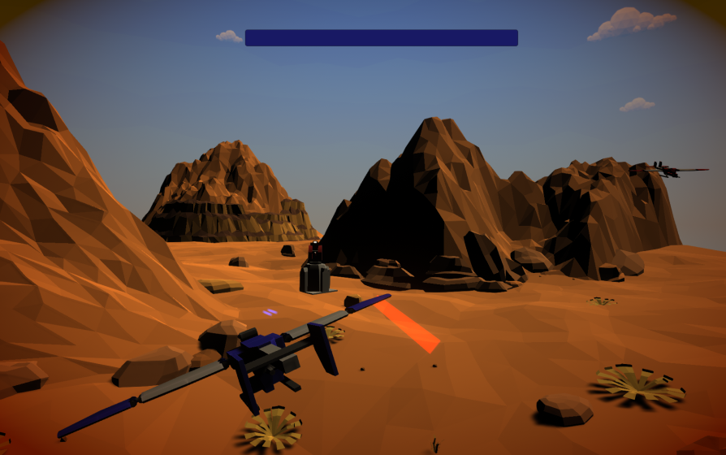

## _**Little Big Tips**_  > Pattern / Algorithm > singleton pattern

Feel free to try this behaviour on the playable demonstration / prototype: [Combat Wings](https://simmer.io/@alissin/combat-wings).

_Note_: The purpose of this demonstration is to evaluate this gameplay mechanic. The scenario and the props are free assets from the Asset Store.

> 

#### Problem description
There are several enemies on this level and all of them need to know where is the player airplane and check if it is close enough to start the attack.

#### Solution simplified concept
This pattern implementation garantees a unique global instance of the player and we can access it whenever we need, wherever we are. Although the singleton pattern is not likely recommended to big games, for simple ones, sometimes, it can worth.

#### Solution suggestion
In this case a singleton instance of a class will keep the reference of the player airplane, more specifically its position and the enemy can check the distance between then to start the attack.<br/>
_Note_: The scope of this _**Little Big Tip**_ is only the singleton pattern.

In the hierarchy, create a game object and name it as `Game Manager`:

```
Hierarchy:
- Game Manager
```

Create a C# script `GameManager.cs` and attach this script to the `Game Manager` game object:

```csharp
public class GameManager : MonoBehaviour
{
    ...
```

Define the fields:

```csharp
// will keep the singleton instance of this object
static GameManager instance;
public static GameManager Instance
{
    get => instance;
}

[SerializeField]
GameObject player;

// as we will need only the player position, let's expose only this information
Vector3 playerPosition;
public Vector3 PlayerPosition
{
    get => playerPosition;
}
```

Don't forget to set the field `player` on `Game Manager` game object via inspector.

Create the singleton instance:

```csharp
void Awake() 
{
    instance = this;
}
```

Make sure the player's position is always up-to-date:

```csharp
void Update()
{
    playerPosition = player.transform.position;
    ...
}
```

Cool! Now, we can access this information whenever we need, wherever we are:

```csharp
void CheckPlayerPosition()
{
    Vector3 playerPosition = GameManager.Instance.PlayerPosition;
    ...
}
```

Ok. Now imagine that we need more singletons classes. We need to avoid duplicating code. So, if we will use a singleton, let's use a... more "elegant" singleton then!<br/>
_Note_: We will use [Generics](https://en.wikipedia.org/wiki/Generic_programming) in this case.

Create a C# script `BaseManager.cs` (abstract class):

```csharp
public abstract class BaseManager<T> : MonoBehaviour where T : BaseManager<T>
{
    static T instance;

    public static T Instance
    {
        get
        {
            // lazy instantiation, in a situation that you need the singleton in runtime but it was not yet instantiated
            if (instance == null)
            {
                GameObject itemClone = new GameObject(typeof(T).Name);
                T manager = itemClone.AddComponent<T>();
                instance = manager;
            }
            return instance;
        }
        set
        {
            if (instance == null)
            {
                instance = value;
                DontDestroyOnLoad(instance.gameObject);
            }
            else if (instance != value)
            {
                // if for some reason, you have duplication, destroy the duplicated instance
                Destroy(value.gameObject);
            }
        }
    }

    void Awake()
    {
        Instance = this as T;
    }
}
```

You can see that the field `instance`, the property `Instance` and the `instance = this` from `Awake()` method were moved to the `BaseManager.cs`.

Make the `GameManager.cs` extends the `BaseManager.cs`, remove the field `instance`, remove the property `Instance`, remove the `Awake()` method implementation from `GameManager.cs`:

```csharp
public class GameManager : BaseManager<GameManager>
{
    ...
```

Pretty cool! Now, if we want to create another singleton class, for example a `UIManager.cs` or `SoundManager.cs`, we just need to extend `BaseManager.cs` and we are done!

#### Scripts:
[BaseManager.cs](./BaseManager.cs), [GameManager.cs](./GameManager.cs)

Again, feel free to try the behaviour of this _**Little Big Tip**_ on [Combat Wings](https://simmer.io/@alissin/combat-wings).

More _**Little Big Tips**_? Nice, [let's go](https://github.com/alissin/little-big-tips)!