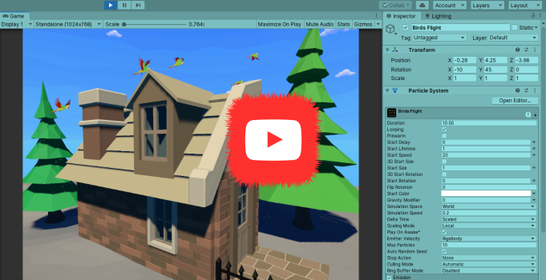
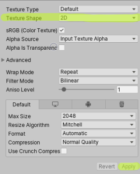
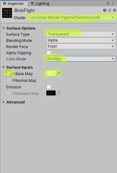

## _**Little Big Tips**_  > VFX - Particle System

### birds flight particle

See this VFX in action [here](https://youtu.be/zzY0PzaFKow).

> [](https://youtu.be/zzY0PzaFKow)

#### Scenario
In a beautiful and sunny day, let's see the birds flying!

#### Solution suggestion
This _**Little Big Tip**_ is a very simple but really nice and handy `Particle System` effect that could be used to make the scene a little bit more fun.

In the hierarchy, create a game object and name it as `Birds Flight`:

```
Hierarchy:
- Birds Flight
```

Don't forget to add a `Particle System` component to the `Birds Flight` game object.

Step 1 - find a very cool sprite sheet with some birds. Don't forget to set the texture shape as `2D` and apply:

> 

Step 2 - create a `Material` and name it as `BirdsFlight`:
* for _Universal RP_, use `Particles/Unlit`, set the surface to `Transparent`, color mode to `Multiply`, select the `Base Map` (select your smoke sprite) and white color for the `Tint Color`:

> 

* for _Legacy_, use `Particles/Alpha Blended`, select the `Texture` (select your smoke sprite) and white color for the `Tint Color`.

Step 3 - select the `Birds Flight` game object and let's work on our `Particle System`:
* renderer module (last module):
    * material: select the `Material` we've created in step 2
* main module:
    * duration: 10
    * start lifetime: 1
    * start speed: 20
    * simulation space: world
    * simulation speed: 0.2
    * max particles: 10
* shape module:
    * angle: 20
    * radius: 0.1
* texture sheet animation module (check it):
    * tiles: set the size of your sprite sheet. In this case, it was used a 3x3 sprite sheet
    * cycles: 20

Step 4 - as you can see, by default, the main module > play on awake is checked. It means the `Particle System` will start its emission immediately when you hit play. Just uncheck it if you don't want it.

Bonus! Step 5 - how about to start or stop the emission programmatically? Here we go:

```csharp
ParticleSystem particleSystem = GetComponent<ParticleSystem>();
particleSystem.Play(); // starts the Particle System
particleSystem.Stop(); // stops the Particle System
```

Again, feel free to see this VFX in action [here](https://youtu.be/zzY0PzaFKow).

More _**Little Big Tips**_? Nice, [let's go](https://github.com/alissin/little-big-tips)!