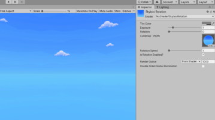
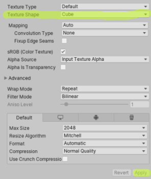
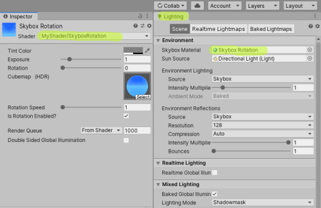

## _**Little Big Tips**_  > VFX - Shaders > sky rotation shader

> [](https://youtu.be/RaVctatXrXM)

Click to see this VFX in action.<br/>
<sub>_Note_: The purpose of this demonstration is to evaluate this VFX. The texture is a free asset from the Asset Store.</sub>

#### Problem description
In addition to making the clouds move, we want to control its velocity and maybe stop its rotation for some reason.

#### Solution suggestion
Unity already has a very cool built-in shader for SkyBox that uses a cubemap for that and makes the rotation possible. We will add a parameter to control the velocity and a toggle to turn on/off the rotation as well.

First, we can find and download all the Unity built-in shaders [here](https://unity3d.com/get-unity/download/archive).

Then, get the `Skybox-Cubed.shader` inside the `DefaultResourcesExtra` folder and put it in your Unity project `Assets` folder. In my case, I renamed the file to `SkyboxRotation.shader`.

Open the shader file on a text editor and rename the path and the name on `Shader` block of code. In my case, I renamed to `"MyShader/SkyboxRotation"`.

Add these properties on `Properties` block of code:

```
_RotationSpeed ("Rotation Speed", Range(1.0, 50.0)) = 10.0
[Toggle] _IsRotationEnabled ("Is Rotation Enabled?", Float) = 1
```

Set the `#pragma shader_feature`, bellow the `CGPROGRAM` and the other `#pragma` lines to use this toggle:

```
CGPROGRAM
#pragma ...
...
#pragma shader_feature _ISROTATIONENABLED_OFF _ISROTATIONENABLED_ON
```

Declare the `_RotationSpeed` property like the other properties:

```
...
half _Exposure;
float _Rotation;
float _RotationSpeed;
```

In the `vert` function (vertex function), use this condition to toggle (on/off) the rotation:

```
...
#if _ISROTATIONENABLED_ON
    _Rotation += _Time.y % 359 * _RotationSpeed;
    float3 rotated = RotateAroundYInDegrees(v.vertex, _Rotation);
    o.vertex = UnityObjectToClipPos(rotated);
#else
    o.vertex = UnityObjectToClipPos(v.vertex);
#endif
...
```

Find a very cool skybox cubemap in the Asset Store and don't forget to set the texture shape as `Cube` and apply:

> 

Create a material, change it to use your shader and finally, change the `Skybox Material` on Lighting Settings (Lighting Settings > Environment > Skybox Material):

> 

To change the rotation value programmatically:

```csharp
Material skyboxMaterial = RenderSettings.skybox;
skyboxMaterial.setFloat("_RotationSpeed", 20.0f);
```

Again, feel free to see this VFX in action [here](https://youtu.be/RaVctatXrXM).

More _**Little Big Tips**_? Nice, [let's go](https://github.com/alissin/little-big-tips)!