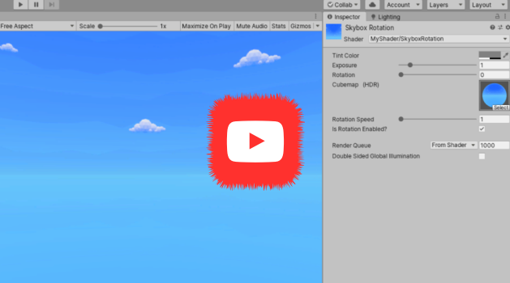

## _**Little Big Tips**_  > VFX - Shaders

### sky rotation shader

See this VFX in action [here](https://youtu.be/RaVctatXrXM)

> [](https://youtu.be/RaVctatXrXM)

#### Scenario
It would be really great not only to see the clouds moving on this amazing sky, on this amazing low poly environment, but also to control the velocity and maybe stop the rotation for some reason.

#### Solution suggestion
Unity already has a very cool built-in shader for SkyBox that uses a cubemap for that and makes the rotation possible. This _**Little Big Tip**_ will only add a parameter to control the velocity and a toggle to turn on/off the rotation as well.

First, we can find and download all the Unity built-in shaders [here](https://unity3d.com/get-unity/download/archive).

Then, get the `Skybox-Cubed.shader` inside the `DefaultResourcesExtra` folder and put it in your Unity project `Assets` folder. In my case, I renamed the file to `SkyboxRotation.shader`.

Step 1 - Open the shader file on a text editor and rename the path and the name on `Shader` block of code. In my case, I renamed to `"MyShader/SkyboxRotation"`.

Step 2 - Add these properties on `Properties` block of code:

```
_RotationSpeed ("Rotation Speed", Range(1.0, 50.0)) = 10.0
[Toggle] _IsRotationEnabled ("Is Rotation Enabled?", Float) = 1
```

Step 3 - set the `#pragma shader_feature`, bellow the `CGPROGRAM` and anothers `#pragma` lines to use this toggle:

```
CGPROGRAM
#pragma ...
...
#pragma shader_feature _ISROTATIONENABLED_OFF _ISROTATIONENABLED_ON
```

Step 4 - declare the `_RotationSpeed` property like the other properties:

```
...
half _Exposure;
float _Rotation;
float _RotationSpeed;
```

Step 5 - in the `vert` function (vertex function), use this condition to toggle (on/off) the rotation:

```
...
#if _ISROTATIONENABLED_ON
    _Rotation += _Time.y % 359 * _RotationSpeed;
    float3 rotated = RotateAroundYInDegrees(v.vertex, _Rotation);
    o.vertex = UnityObjectToClipPos(rotated);
#else
    o.vertex = UnityObjectToClipPos(v.vertex);
#endif
...
```

Step 6 - find a very cool skybox cubemap in the Asset Store and don't forget to set the texture shape as `Cube` and apply:

> 

Step 7 - create a material, change it to use your shader and finally, change the `Skybox Material` on Lighting Settings (Lighting Settings > Environment > Skybox Material):

> 

Step 8 - hit play!

Bonus! - Step 9 - want to change the rotation value programmatically? Here we go:

```csharp
Material skyboxMaterial = RenderSettings.skybox;
skyboxMaterial.setFloat("_RotationSpeed", 20.0f);
```

More _**Little Big Tips**_? Nice, [follow me](https://github.com/alissin/little-big-tips)!