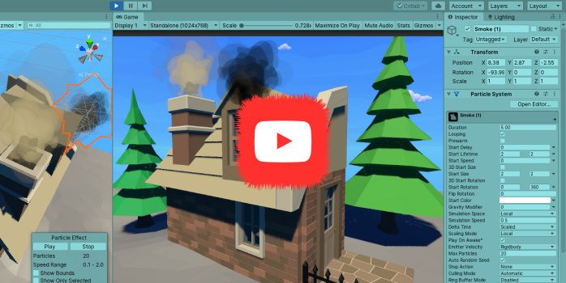
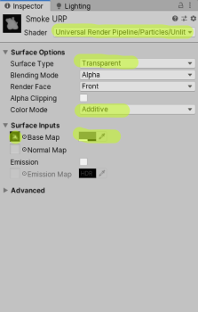
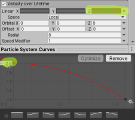

## _**Little Big Tips**_  > VFX - Particle System

### smoke particle

See this VFX in action [here](https://youtu.be/2QzYuhXA2_w).

_Note_: The purpose of this demonstration is to evaluate this VFX. The amazing scenario and the props are free assets from the Asset Store.

> [](https://youtu.be/2QzYuhXA2_w)

#### Scenario
It would be really great to see some smoke going out from the house. I suppose something really good has been prepared in the kitchen for the breakfast. But wait, what's happening in the bedroom? I guess something was forgotten plugged last night...

#### Solution suggestion
This _**Little Big Tip**_ is a very simple but really nice and handy `Particle System` effect. Both smokes have almost the same settings. We will create the black smoke example and then you can duplicate it and play with the values by yourself.

In the hierarchy, create a game object and name it as `Smoke`:

```
Hierarchy:
- Smoke
```

Don't forget to add a `Particle System` component to the `Smoke` game object.

Step 1 - find a very cool cloud / smoke sprite. As suggestion, you can use the `SplatAlbedo.tif` from the `Unity Particle Pack` from the Asset Store. Don't forget to set the texture shape as `2D` and apply:

> 

Step 2 - create a `Material` and name it as `Smoke`:
* for _Universal RP_, use `Particles/Unlit`, set the surface to `Transparent`, color mode to `Additive`, select the `Base Map` (select your smoke sprite) and a grey color with alpha 128 for the `Tint Color`:

> 

* for _Legacy_, use `Particles/Alpha Blended`, select the `Texture` (select your smoke sprite) and a grey color with alpha 128 for the `Tint Color`.

Step 3 - select the `Smoke` game object and let's work on our `Particle System`:
* renderer module (last module):
    * material: select the `Material` we've created in step 2
* main module:
    * start lifetime: 2
    * start speed: 0
    * start size: 2
    * start rotation: 0 - 360 (two constants)
    * simulation speed: 0.5
* emission module:
    * rate over time: 10
* shape module (uncheck it)
* velocity over lifetime module (check it):
    * linear: change it to curve, change the Z to a curve starting with 2 and finishing with 0:
> 
* color over lifetime module (check it):
    * color: select a sequence of colors of your choice
* size over lifetime module (check it):
    * size: select the curve of your choice

Step 4 - as you can see, by default, the main module > play on awake is checked. It means the `Particle System` will start its emission immediately when you hit play. Just uncheck it if you don't want it.

Bonus! Step 5 - how about to start or stop the emission programmatically? Here we go:

```csharp
ParticleSystem particleSystem = GetComponent<ParticleSystem>();
particleSystem.Play(); // starts the Particle System
particleSystem.Stop(); // stops the Particle System
```

Again, feel free to see this VFX in action [here](https://youtu.be/2QzYuhXA2_w).

More _**Little Big Tips**_? Nice, [let's go](https://github.com/alissin/little-big-tips)!