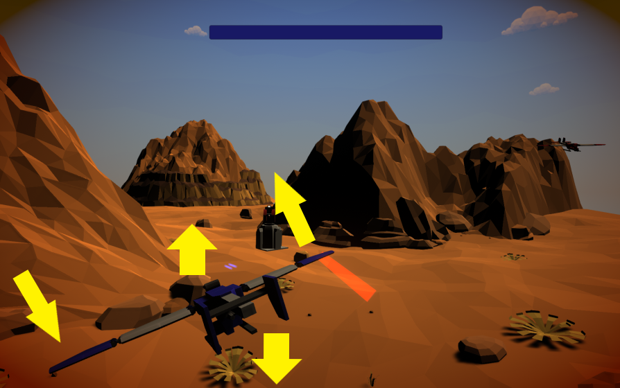

## _**Little Big Tips**_  > General tips > airplane movement

Feel free to try this behaviour on the playable demonstration / prototype: [Combat Wings](https://simmer.io/@alissin/combat-wings).

_Note_: The purpose of this demonstration is to evaluate this gameplay mechanic. The scenario and the props are free assets from the Asset Store.

> 

#### Problem description
In this case, although the path rail mechanism is responsible to move the airplane through the scenario, it's up to us to take care of the airplane local movement.

#### Solution simplified concept
The player airplane local movement implementation is based on the [Aircraft principal axes](https://en.wikipedia.org/wiki/Aircraft_principal_axes) concept. So, the Pitch factor will be applied to the X axis, Yaw factor to the Y axis and Roll factor to the Z axis.

#### Solution suggestion
The path rail mechanism actually controls the `Camera` game object and the `Player` game object is nested (as a child) to it:

```
Scene (game objects) hierarchy:
- Camera
-- Player
```

Create a C# script `Player.cs` and attach this script to the `Player` game object:

```csharp
public class Player : MonoBehaviour
{
    ...
```

Define the fields:

```csharp
[SerializeField]
[Range(5.0f, 20.0f)]
float movementSpeed = 8.0f;

[SerializeField]
float yawFactor = 3.0f;

[SerializeField]
float pitchFactor = 2.5f;

[SerializeField]
float rotationFactor = 20.0f;

[SerializeField]
float rollFactor = 15.0f;

const float maxHorRangePosition = 5.0f;
const float maxVerRangePosition = 4.0f;

float lh, lv;
```

Get the axis (movement) values to setup the position and rotation on each frame:

```csharp
void Update()
{
    lh = Input.GetAxis("Horizontal");
    lv = Input.GetAxis("Vertical");

    SetupPosition();
    SetupRotation();
}
```

Let's setup the position:<br/>
_Note_: We will use the localPosition because `Player` is a child of the Main Camera and the `Clamp` method to limit the screen.

```csharp
void SetupPosition()
{
    // horizontal and vertical offset
    float realTimeMovementSpeed = movementSpeed * Time.deltaTime;
    float lhOffset = lh * realTimeMovementSpeed;
    float lvOffset = lv * realTimeMovementSpeed;

    // clamp the values to limit the screen
    float xPos = Mathf.Clamp(lhOffset + transform.localPosition.x, -maxHorRangePosition, maxHorRangePosition);
    float yPos = Mathf.Clamp(-lvOffset + transform.localPosition.y, -maxVerRangePosition, maxVerRangePosition);

    // localPosition because `Player` is a child of the Main Camera
    transform.localPosition = new Vector3(xPos, yPos, transform.localPosition.z);
}
```

Finally, let's setup the rotation:<br/>
_Note_: We will use the localRotation because `Player` is a child of the Main Camera.

```csharp
void SetupRotation()
{
    float xRot = transform.localPosition.y * -pitchFactor + lv * rotationFactor;
    float yRot = transform.localPosition.x * yawFactor + lh * rotationFactor;
    float zRot = -lh * rollFactor;

    transform.localRotation = Quaternion.Euler(xRot, yRot, zRot);
}
```

#### Scripts:
[Player.cs](./Player.cs)

Again, feel free to try the behaviour of this _**Little Big Tip**_ on [Combat Wings](https://simmer.io/@alissin/combat-wings).

More _**Little Big Tips**_? Nice, [let's go](https://github.com/alissin/little-big-tips)!