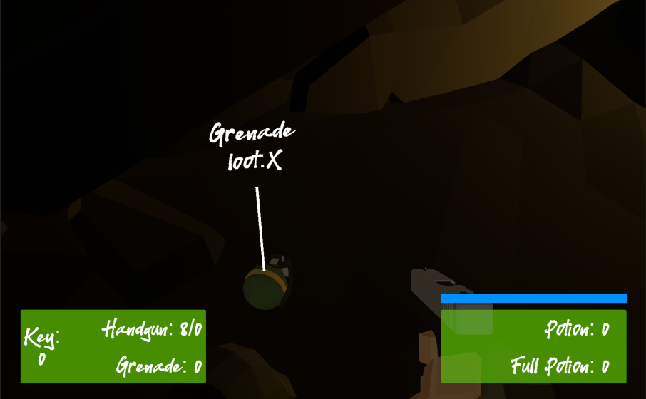

## _**Little Big Tips**_  > General tips > drop item by chance

Feel free to try this behaviour on the playable demonstration / prototype: [The Dungeon](https://simmer.io/@alissin/the-dungeon).

_Note_: The purpose of this demonstration is to evaluate this gameplay mechanic. The FPS shooter gameplay mechanic itself, the scenario and the props are free assets from the Asset Store.

> 

#### Problem description
We could do a simple drop mechanic like put all items in an array and then get a random index and instantiate the item. But sometimes the random index is not enough. 

#### Solution suggestion
A good way to so solve that is a mechanic based on drop chance. For example, the health potion has a 0.4 (40%) of chance against 0.1 (10%) of the grenade.

_Note:_ We will use `Scriptable Objects` to make this more professional and fun. So, I suggest to read the [flyweight pattern](../_pattern-algorithm/flyweight) to have a better understand of that.

In the hierarchy, create 3 game objects and name them as `Item Drop Manager`, `Grenade` and `Health Potion`:

```
Hierarchy:
- Item Drop Manager
- Grenade
- Health Potion
```

Create a C# script `ItemDropManager.cs` and attach this script to the `Item Drop Manager` game object:

```csharp
public class ItemDropManager : MonoBehaviour
{
    ...
```

Let's create our `Scripttable Object`. Create a C# Script `ItemSO.cs` and define the fields:<br/>
_Note:_ Again, if necessary, don't forget to read the [flyweight pattern](../_pattern-algorithm/flyweight) to have a better understand of that.

```csharp
[CreateAssetMenu(fileName = "ItemSO", menuName = "Item")]
public class ItemSO : ScriptableObject
{
    public GameObject prefab;
    public float value;
    public float dropChance;
    public string description;
}
```

Create the class that will use this `Scriptable Object`. Create a C# Script `Item.cs` and define the fields:

```csharp
public class Item : MonoBehaviour
{
    [SerializeField]
    ItemSO itemSO;

    float currentValue;

    void Start()
    {
        currentValue = itemSO.value;
    }
}
```

Go back to our hierarchy and attach this script to both the `Grenade` and `Health Potion` game objects.

At this point, we should have:

```
Hierarchy:
- Item Drop Manager -> with the `ItemDropManager.cs` script
- Grenade -> with the `Item.cs` script
- Health Potion -> with the `Item.cs` script
```

Create 2 items from our `ItemSO` and name them as `GrenadeSO` and `HealthPotionSO`.<br/>
_Note:_ On project folder, mouse right click on `ItemSO` > Create > Item.

Via inspector, attach these new 2 items to the respectively fields on the `Grenade` and `Health Potion` game objects.

At this point, we should have:

```
Hierarchy:
- Item Drop Manager -> `ItemDropManager.cs` script
- Grenade -> `Item.cs` script + `GrenadeSO` attached on it
- Health Potion -> `Item.cs` script + `HealthPotionSO` attached on it
```

Prefab the `Grenade` and `Health Potion` game objects and remove them from the scene.

Play with the values of the `GrenadeSO` and `HealthPotionSO` items, like so:

```
GrenadeSO:
- Prefab: Grenade (prefab)
- Value: 1
- Drop Chance: 0.1
- Description: Grenade

HealthPotionSO:
- Prefab: Health Potion (prefab)
- Value: 10
- Drop Chance: 0.4
- Description: Health Potion
```

Now, let's finish our `ItemDropManager.cs`. Define the fields:

```csharp
[SerializeField]
ItemSO[] itemsSO;

float totalDropChance;
```

In the hierarchy, select the `Item Drop Manager` game object and via inspector, attach the `GrenadeSO` and `HealthPotionSO` items to the `ItemsSO` array field.

Calculate the total drop chance that we have:

```csharp
void Start()
{
    foreach (var item in itemsSO)
    {
        totalDropChance += item.dropChance;
    }
}
```

Finally, let's create the method responsible for randomly drop the items:

```csharp
public void DropItem(Vector3 dropPosition)
{
    float random = Mathf.Round(Random.Range(0, totalDropChance) * 10.0f) / 10.0f;

    float whichItem = 0.0f;
    foreach (var item in itemsSO)
    {
        whichItem += item.dropChance;
        if (whichItem >= random)
        {
            Instantiate(item.prefab, dropPosition, item.prefab.transform.rotation);
            break;
        }
    }
}
```

As you can see, the logic uses the `totalDropChance` as a total chance, It means, as our 100% mark in our range. In other words, in this case, this logic will always drop something and the 40% (`HealthPotionSO`) represents 80% and 10% (`GrenadeSO`) represents 20% as well. If we consider more `ItemSO` in our array of items, no problem, our logic is prepared!

Pretty cool! Now, on enemy's death for example, we can call the `DropItem()` method and see a random drop item for loot, like so:

```csharp
public class Enemy : MonoBehaviour
{  
    void OnDeath()
    {
        itemDropManager.DropItem(transform.position);
    }
}
```

#### Scripts:
[ItemDropManager.cs](./ItemDropManager.cs), [ItemSO.cs](./ItemSO.cs), [Item.cs](./Item.cs)

Again, feel free to try the behaviour of this _**Little Big Tip**_ on [The Dungeon](https://simmer.io/@alissin/the-dungeon).

More _**Little Big Tips**_? Nice, [let's go](https://github.com/alissin/little-big-tips)!