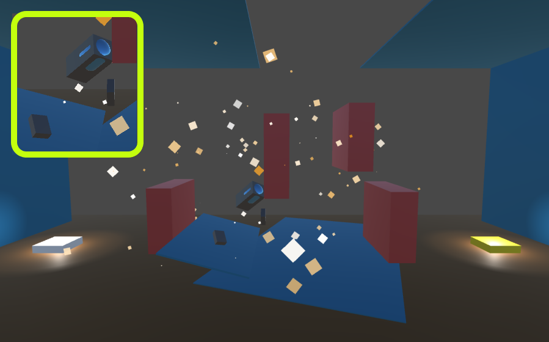

## _**Little Big Tips**_  > General tips > explode the rocket

> 

Feel free to try this behaviour on the playable demonstration / prototype: [Boost the Rocket](https://simmer.io/@alissin/boost-the-rocket).

#### Problem description
The visual effect is very important and bring more realism and fun to the game. So, when the rocket explodes, all the pieces should fly away.

#### Solution simplified concept
When the explosion happens, we will use a "breakable" game object and apply the Physics force to each piece to different directions.

#### Solution suggestion
In this case, we have 2 game objects (Prefabs): the `Player` and the `Breakable Player`. When the `Player` hits something, it's destroyed and immediatly the `Breakable Player` is instantiated at the same position and rotation and the Physics force is applied to it, individually on each "breakable" piece.

Create a C# script `Player.cs` and attach this script to the `Player` game object:

```csharp
public class Player : MonoBehaviour
{
    ...
```

Define the fields:

```csharp
[SerializeField]
GameObject breakablePlayerPrefab;
```

Call the `Explode()` method when the `Player` dies. It's up to you how to call this method. In this case, it's called when the `Player` hits something, on `OnCollisionEnter()` method. In the `Player.cs` script:

```csharp
void OnCollisionEnter(Collision collision)
{
    Explode();
}

void Explode()
{
    Instantiate(breakablePlayerPrefab, transform.position, transform.rotation);
    Destroy(gameObject);
}
```

Create a C# script `BreakablePlayer.cs`, attach this script to the `Breakable Player` game object, create a Prefab of it and remove it from the scene:

```csharp
public class BreakablePlayer : MonoBehaviour
{
    ...
```

Define the fields:

```csharp
Vector3[] explosionDirections;
```

Don't forget to set the field `breakablePlayerPrefab` on `Player` game object via inspector.

When we instantiate the `Breakable Player` game object, the `BreakablePlayer.Start()` method is called. In the `BreakablePlayer.cs` script:<br/>
<sub>_Note:_ the Physics force is applied individually on each one of the childs ("breakable" pieces).</sub>

```csharp
void Start()
{
    explosionDirections = new Vector3[] { Vector3.up, Vector3.right, -Vector3.one };

    // get all the childs ("breakable" pieces) and apply the Physics force individually on each one
    for (int i = 0; i < transform.childCount - 1; i++)
    {
        ImpulseByExplosion(transform.GetChild(i), i);
    }
}
```

Let's give a little push to each "breakable" piece:<br/>
<sub>_Note:_ each child game object of the `Breakable Player` game object should have a `RigidBody` attached.</sub>

```csharp
void ImpulseByExplosion(Transform transform, int idx)
{
    float factor = Random.Range(0.2f, 1.0f);
    float explosionImpulse = Random.Range(50.0f, 100.0f);
    transform.GetComponent<Rigidbody>().AddRelativeForce(explosionDirections[idx % explosionDirections.Length] * factor * explosionImpulse, ForceMode.Impulse);
}
```

#### Scripts:
[Player.cs](./Player.cs), [BreakablePlayer.cs](./BreakablePlayer.cs)

Again, feel free to try the behaviour of this _**Little Big Tip**_ on [Boost the Rocket](https://simmer.io/@alissin/boost-the-rocket).

More _**Little Big Tips**_? Nice, [let's go](https://github.com/alissin/little-big-tips)!