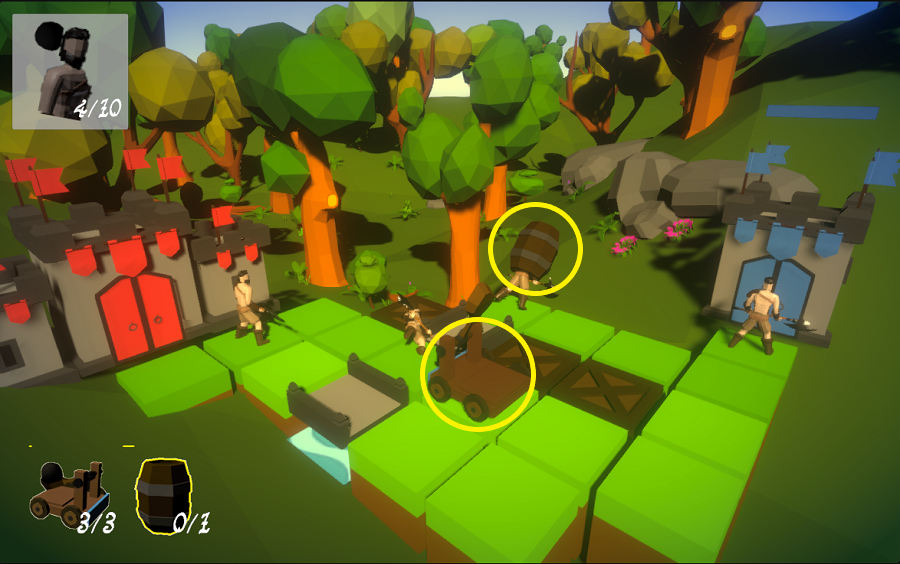

## _**Little Big Tips**_  > General tips > raycast 3D click / touch detection

> 

Feel free to try this behaviour on the playable demonstration / prototype: [Realm Defender](https://simmer.io/@alissin/realm-defender).<br/>
<sub>_Note:_ The purpose of this demonstration is to evaluate this gameplay mechanic. The scenario and the props are free assets from the Asset Store.</sub>

#### Problem description
We need to stop the enemy warriors deploying catapults and barrels on a specific place in the 3D world space by clicking / touching.

#### Solution simplified concept
We can use the `Physics.Raycast` to detect the collisions points of the touch or the mouse click on the screen.

#### Solution suggestion
As we will use the `Physics.Raycast`, we need to make sure that all the placeable game objects have a `Collider` attached. In this case, the lighter green blocks (to deploy the catapults) and the warriors (to deploy the barrels).<br/>
<sub>_Note:_ the mechanism of this prototype receives the catapult on the lighter green blocks and the barrels directly on the warriors head. This _**Little Big Tip**_ will cover only the catapult deploy using the raycast technique. The way to deal with the barrel is almost the same.</sub>

In the hierarchy, create a game object and name it as `Input Controller`:

```
Hierarchy:
- Input Controller
```

Create a C# script `InputController.cs` and attach this script to the `Input Controller` game object:

```csharp
public class InputController : MonoBehaviour
{
    ...
```

Define the fields:

```csharp
[SerializeField]
GameObject weaponPrefab;
```

Don't forget to set the field `weaponPrefab` on `Input Controller` game object via inspector. In this case, the weapon is the catapult.

Create a `Block` game object in the hierarchy and set the tag to `Ground`. This game object is where we will deploy our weapon. Don't forget to attach the `Block.cs` script to it.<br/>
<sub>_Note:_ you can find the `Block.cs` script in the repository.</sub>

Based on the camera position, we can find where the player is touching / clicking on the screen and the `Physics.Raycast` will give us the game object that was hit:

```csharp
void Update()
{
    if (Input.GetMouseButtonDown(0))
    {
        RaycastHit hit;
        Ray ray = Camera.main.ScreenPointToRay(Input.mousePosition);

        if (Physics.Raycast(ray, out hit))
        {
            if (hit.transform.CompareTag("Ground"))
            {
                Block block = hit.transform.GetComponent<Block>();
                DeployWeapon(block);
            }
        }
    }
}
```

Now, just instantiate a new game object based on our `weaponPrefab`. Use the position of the given `block` parameter to deploy it on the right place:

```csharp
void DeployWeapon(Block block)
{
    Vector3 blockPos = block.GetPosition();
    Vector3 weaponPos = new Vector3(blockPos.x, weaponPrefab.transform.position.y, blockPos.z);

    Instantiate(weaponPrefab, weaponPos, Quaternion.identity);
}
```

<sub>_Note:_ To keep this example simple and focused on the touch / click mechanism, we are just instantiating the weapon game object on hit position. In a real development scenario, I suggest to use a more optimized and performatic technique like [object pool](../../pattern-algorithm/object-pool).</sub>

#### Scripts:
[InputController.cs](./InputController.cs), [Block.cs](./Block.cs)

Again, feel free to try the behaviour of this _**Little Big Tip**_ on [Realm Defender](https://simmer.io/@alissin/realm-defender).

More _**Little Big Tips**_? Nice, [let's go](https://github.com/alissin/little-big-tips)!