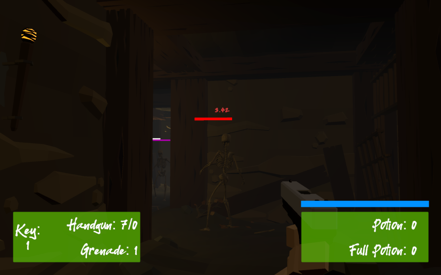

## _**Little Big Tips**_  > General tips > hit damage calculation

Feel free to try this behaviour on the playable demonstration / prototype: [The Dungeon](https://simmer.io/@alissin/the-dungeon).

_Note_: The purpose of this demonstration is to evaluate this gameplay mechanic. The FPS shooter gameplay mechanic itself, the scenario and the props are free assets from the Asset Store.

> 

#### Problem description
Not only the difference between the armor and health, but it could be really nice if we have different amount of damage on hitting the body or head. And, how about a critical hit chance?

#### Solution suggestion
We will implement our damage system calculation based on crititcal hit chance and critical hit damage.<br/>
_Note:_ To keep this example simple and focused on the hit damage calculation, it's up to you to decide how to control the attack and damage mechanism. As a suggestion, you could use the [component pattern](../_pattern-algorithm/component) to help on it.

In the hierarchy, create an empty game object and name it as `Enemy`. Nested to the `Enemy` game object, create a cube and name it as `Body` and a sphere and name it as `Head`.<br/>
Create a capsule and name it as `Bullet`.<br/>
In the end, they should have the following structure and settings:

```
Hierarchy:
- Enemy -> (empty game objct) with a Rigidbody (Use Gravity on / Is Kinematic on)
-- Head -> a sphere with a Sphere Collider
-- Body -> a cube with a Box Collider
- Bullet -> a capsule with a Capsule Collider + Rigidbody (Use Gravity off / Is Kinematic off)
```

Create a `Scripttable Object` that will be responsible for setup our attack damage information and to calculate the damage itself. Create a C# Script `AttackSO.cs` and define the fields:<br/>
_Note:_ if necessary, I suggest a read on the [flyweight pattern](../_pattern-algorithm/flyweight) to have a better understand of `Scripttable Objects`.

```csharp
[CreateAssetMenu(fileName = "AttackSO", menuName = "Attack")]
public class AttackSO : ScriptableObject
{
    public enum Type
    {
        Body,
        Head
    }

    public enum Phase
    {
        Armor,
        Health
    }

    public float baseDamage;

    public float headDamageFactor;

    public float criticalHitChance;
    public float criticalHitDamageFactor;

    public float damageToArmorFactor;
    public float damageToHealthFactor;
}
```

Now the methods that will do the calculation of the attack:

```csharp
public float CalculateDamage(Type type, Phase phase)
{
    float phaseDamage = CalculatePhaseDamage(phase);

    bool isCriticalHit = IsCriticalHit;
    float bodyDamage = CalculateBodyDamage(isCriticalHit);

    float finalDamage = 0.0f;
    switch (type)
    {
        case Type.Body:
            finalDamage = bodyDamage + phaseDamage;
            break;

        case Type.Head:
            finalDamage = CalculateHeadDamage(bodyDamage) + phaseDamage;
            break;
    }

    return finalDamage;
}

bool IsCriticalHit
{
    get => Random.value <= criticalHitChance;
}

float CalculateBodyDamage(bool isCriticalHit)
{
    return baseDamage + (isCriticalHit ? baseDamage * criticalHitDamageFactor : 0);
}

float CalculateHeadDamage(float bodyDamage)
{
    return bodyDamage + (baseDamage * headDamageFactor);
}

float CalculatePhaseDamage(Phase phase)
{
    float phaseDamage = 0.0f;
    switch (phase)
    {
        case Phase.Armor:
            phaseDamage = baseDamage * damageToArmorFactor;
            break;

        case Phase.Health:
            phaseDamage = baseDamage * damageToHealthFactor;
            break;
    }
    return phaseDamage;
}
```

As you can see, our calculation method checks if the hit point comes from the head or the body and if it's armor or health damage as well.

Create the `BulletAttack` based on our `AttackSO` and via inspector, play with the values. As a suggestion:<br/>
_Note:_ On project folder, mouse right click on `AttackSO` > Create > Attack.

```
Base Damage: 1.8
Head Damage Factor: 0.7
Critical Hit Chance: 0.2
Critical Hit Damage: 0.5
Damage to Armor Factor: 0
Damage to Health Factor: 0.2
```

Create a C# script `Bullet.cs` and attach this script to the `Bullet` game object. Then, define the fields:

```csharp
public class Bullet : MonoBehaviour
{
    [SerializeField]
    AttackSO attackSO;
}
```

Via inspector, attach the `BulletAttack` to the `attackSO` field. Now, we have our attack setup.

Create a class to define the type of the collision, in our case head or body:

```csharp
public class CollisionType : MonoBehaviour
{
    [SerializeField]
    AttackSO.Type type;
    public AttackSO.Type Type
    {
        get => type;
    }
}
```

Attach this script to the `Head` and `Body` game objects nested to the `Enemy` game object. Don't forget to set the correct type via inspector.

Let's make our `Enemy` damageable. First the interface and then the class that implements that.

```csharp
public interface IDamageable
{
    void OnTakeDamage(AttackSO attackSO, AttackSO.Type type);
}
```

```csharp
public class EnemyDamageable : MonoBehaviour, IDamageable
{
    float armor = 5.0f;
    float health = 10.0f;

    public void OnTakeDamage(AttackSO attackSO, AttackSO.Type type)
    {
        if (armor > 0)
        {
            float armorDamage = attackSO.CalculateDamage(type, AttackSO2.Phase.Armor);
            armor -= armorDamage;
            // TODO: impl. update the armor on UI
            Debug.LogFormat("Damage on {0} (Armor) -> amount: {1}", type, armorDamage);
            return;
        }

        float healthDamage = attackSO.CalculateDamage(type, AttackSO2.Phase.Health);
        health -= healthDamage;
        // TODO: impl. update the health on UI
        Debug.LogFormat("Damage on {0} (Health) -> amount: {1}", type, healthDamage);
        if (health <= Mathf.Epsilon)
        {
            // TODO: impl. Enemy's death
        }
    }
}
```

Attach the `EnemyDamageable.cs` to the `Enemy` game object.

As you can see, when the `Enemy` takes damage, it will receive the attack with the type of the attack and we only need to use the `CalculateDamage()` method that will take care of the calculation and will return the final damage that should be subtracted from the armor or health.

Let's implement the collision and make the `Bullet` hurts our `Enemy`. In the `Bullet.cs` script:

```csharp
void OnCollisionEnter(Collision collision)
{
    CollisionType collisionType = collision.collider.gameObject.GetComponent<CollisionType>();

    if (collisionType != null)
    {
        IDamageable damageable = collision.gameObject.GetComponent<IDamageable>();

        if (damageable != null)
        {
            damageable.OnTakeDamage(attackSO, collisionType.Type);
        }
    }
}
```

Cool! If the `Bullet` hits the `Head` or the `Body`, the `CollitionType` will return the correct type (`AttackSO.Type`). Then, we only need to get the `IDamageable.cs` component, in this case it will be the `EnemyDamageable.cs`, call the `OnTakeDamage()` method and finally, this method will take care of the rest.

To see the behaviour in action, hit play, move the bullet to hit the `Head` or the `Body` of the `Enemy` and check the console to see the amount of damage the `Enemy` received.

#### Scripts:
[AttackSO.cs](./AttackSO.cs), [Bullet.cs](./Bullet.cs), [CollisionType.cs](./CollisionType.cs), [IDamageable.cs](./IDamageable.cs), [EnemyDamageable.cs](./EnemyDamageable.cs)

Again, feel free to try the behaviour of this _**Little Big Tip**_ on [The Dungeon](https://simmer.io/@alissin/the-dungeon).

More _**Little Big Tips**_? Nice, [let's go](https://github.com/alissin/little-big-tips)!