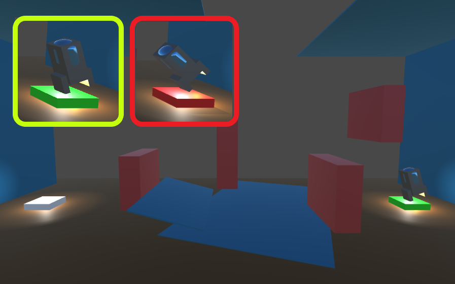

## _**Little Big Tips**_  > General tips

### land the rocket

Based on this playable demonstration / prototype: [Boost the Rocket](https://simmer.io/@alissin/boost-the-rocket).<br/>
Feel free to try the behaviour of this _**Little Big Tip**_.

> 

#### Scenario
Let's land the rocket with style and smoothly!

#### Problem description
How to have a more realistic and smoothly landing when close to the landing pad?

#### Solution suggestion
When the rocket player gets closer to the landing pad, it checks the angle of the rotation and if it's safe (green), it takes care of a smooth and nice rocket landing!<br/>
_Note:_ the scope of this _**Little Big Tip**_ is only the smooth landing.

You can try the behaviour [here](https://simmer.io/@alissin/boost-the-rocket).

Create a C# script `Player.cs` and attach this script to the `Player` game object:

```csharp
public class Player : MonoBehaviour {
    ...
```

Define the fields:

```csharp
const float _maxRayGroundedDistance = 2.0f;
const int _safeLandingAngle = 30;

bool _isLandingCompleted = false;
```

Set the tag of your landing pad game object to `Landing Pad`.

Step 1 - check if the `Player` is close to the landing pad and in a safe angle to land:<br/>
_Note:_ as you can see on the image and on the playable demonstration above, the landing pad uses the `IsSafeLandingAngle()` method to check if it's red or green when the `Player` gets close.<br/>
_Note 2:_ the color change is out of scope of this _**Little Big Tip**_.

```csharp
void OnCollisionEnter(Collision collision) {
    if (collision.gameObject.CompareTag("Landing Pad")) {
        if (!IsSafeLandingAngle()) {
            // TODO: run player die / explosion method
        }
    } else {
        // TODO: run player die / explosion method
    }
}

public bool IsSafeLandingAngle() {
    return Vector3.Angle(transform.up, Vector3.up) <= _safeLandingAngle;
}
```

Step 2 - as you can see on the above snippet, if we collide with the landing pad in a safe landing angle, nothing will happen. In this case, we will use the `Physics.Raycast` to check if the `Player` is close to the landing pad to finally land it:

```csharp
void Update() {
    Ray ray = new Ray(transform.position, -Vector3.up);
    RaycastHit hit;

    if (Physics.Raycast(ray, out hit, _maxRayGroundedDistance)) {
        if (hit.transform.gameObject.CompareTag("Landing Pad")) {
            Land(hit.transform);
        }
    } else {
        _isLandingCompleted = false;
    }
}
```

Step 3 - finally, the most fun part, let's take care of our super smooth and stylish landing:<br/>
_Note:_ our rocket Player fits the right place above the landing pad smoothly.

```csharp
void Land(Transform groundTransform) {
    if (!_isLandingCompleted) {
        // TODO: check if this ground / landing offset position of the Player makes sense for you. In my case, I used 1.95f
        float landingYPos = groundTransform.position.y + 2.0f;

        Vector3 targetPos = new Vector3(groundTransform.position.x, landingYPos, groundTransform.position.z);

        if (transform.position != targetPos) {
            transform.position = Vector3.MoveTowards(transform.position, targetPos, Time.deltaTime);
        } else {
            _isLandingCompleted = true;
            transform.rotation = Quaternion.identity;
        }
    }
}
```

Step 4 - make sure to have a `Rigibody` (`gravity == true` / `kinematic == false`) and a `Collider` components attached to the `Player` game object. In this case, I used `mass == 15` and `drag == 5`.

Step 5 - make sure to have a `Collider` component attached to your landing pad game object.

#### Scripts:
[Player.cs](./Player.cs)

Again, feel free to try the behaviour of this _**Little Big Tip**_ on [Boost the Rocket](https://simmer.io/@alissin/boost-the-rocket).

More _**Little Big Tips**_? Nice, [let's go](https://github.com/alissin/little-big-tips)!