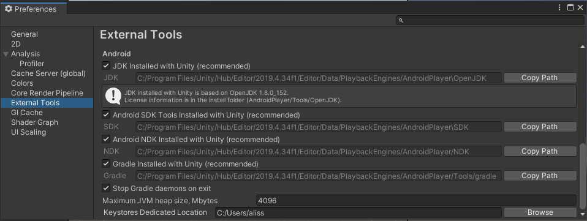
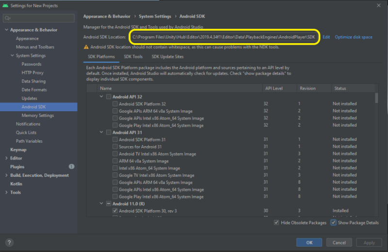

## _**Little Big Tips**_  > Other tips > android sdk location

#### Problem description
Sometimes, we fail to build an _apk_ in Unity because we don't have the properly Android api vesion installed. So, where to find the Android SDK installation that Unity is actually using?

#### Solution suggestion
On Windows, this is the default Android SDK installation path location:

```
C:\Users\<user>\AppData\Local\Android\Sdk
``` 

By default, Unity uses the built-in Android SDK installation:

```
C:\Program Files\Unity\Hub\Editor\<unityvesion>\Editor\Data\PlaybackEngines\AndroidPlayer\SDK
```

To check this, go to Edit > Preferences > External Tools. As you can see, in this case, Unity is using the built-in Android SDK installation:

> 

Now that we know which Android SDK installation path Unity is using, we can use the SDK Manager to manage it:

> 

More _**Little Big Tips**_? Nice, [let's go](https://github.com/alissin/little-big-tips)!