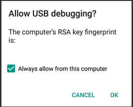

## _**Little Big Tips**_  > Other tips > apk installation (command line)

#### Problem description
How to install and test an _apk_ on a device simply and quickly? 

#### Solution suggestion
A very simple and fast way to do this is use command line.<br/>
<sub>_Note:_ Make sure that you have the Android SDK properly installed. See more about on the official Android SDK installation website.</sub>

Firstly, make sure to enable the _Developer options_ on your Android device: touch the _Build number_ repeatedly until you see the confirmation message and then enable the _USB debugging_ like so:

> 

Now, plug your device on your computer using the USB cable and allow the USB debugging:

> 

After build your game in Unity and generate the _apk_ file, open the _Run_ app:

> 

Then open the _Command Prompt_:

> 

<sub>_Note:_ All the process and the following commands are very similar on macOS as well.</sub>

Now, type this command to go to the _adb_ installation:<br/>
<sub>_Note:_ This is the default path on Windows.</sub>

```
cd AppData\Local\Android\Sdk\platform-tools
```

Then type this command to see your attached device:

```
adb devices
```

Your should see a message like this:

> 

Finally, install your game:<br/>
<sub>_Note:_ Change the path to your _apk_ file.</sub>

```
adb install -r D:\Downloads\Builds\MyGame.apk
```

Sometimes, we need to kill and restart the _adb_ server. So, we can use:

```
adb kill-server
adb start-server
```

More _**Little Big Tips**_? Nice, [let's go](https://github.com/alissin/little-big-tips)!