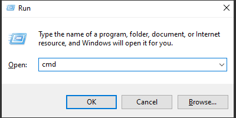
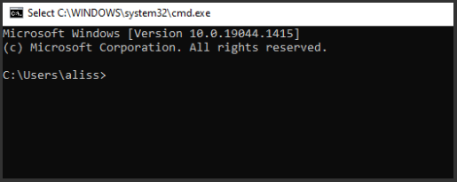

## _**Little Big Tips**_  > Other tips > run webgl locally

#### Problem description
Sometimes, we try to run an Unity WebGL `index.html` file on a browser, to test an Unity WebGL build locally and it fails.

#### Solution suggestion
Unity provides a tool to support and run a WebGL build locally.

It's very simple to use. First, open the _Run_ app:

> 

Then open the _Command Prompt_:

> 

<sub>_Note:_ All the process and the following commands are very similar on macOS as well.</sub>

Now, type this command to go to the Unity WebGL support tools installation:

```
cd C:\Program Files\Unity\Hub\Editor\<unityversion>\Editor\Data\PlaybackEngines\WebGLSupport\BuildTools
```

Then type this command to start the local web server:

```
SimpleWebServer.exe "D:\Downloads\Builds\MyGame" 8000
```

Finally, run your game on a browser:<br/>

```
http://localhost:8000/
```

More _**Little Big Tips**_? Nice, [let's go](https://github.com/alissin/little-big-tips)!