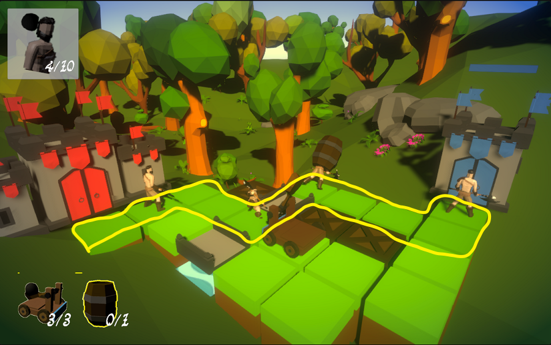

## _**Little Big Tips**_  > Patterns / Algorithms > pathfinder using Breadth First Search

> 

Feel free to try this behaviour on the playable demonstration / prototype: [Realm Defender](https://simmer.io/@alissin/realm-defender).<br/>
<sub>_Note:_ The purpose of this demonstration is to evaluate this gameplay mechanic. The scenario and the props are free assets from the Asset Store.</sub>

#### Problem description
We need to find the shortest path between the start point (red castle) and end point (blue castle).

#### Solution simplified concept
The technique of _Breadth First Search_ consists in, given a start point, it looks for the neighbour points (blocks in this case), it sets on each of these blocks where the search comes from (I like to refer this as "tail") and finally, once the algorithm finds the end point, it reads each block backwards (starting with the end point), checks the "tail" and creates a (reverse) list with it.

#### Solution suggestion
In this case, the path will not change in runtime. When the level starts, the shortest path should already be defined and the enemy warriors should have access to it.

In the hierarchy, create a game object and put all the blocks nested (as a child) to this game object. Name this as `Level`:

```
Hierarchy:
- Level
-- Block 1
-- Block 2
...
-- Block N
```

Create a C# script `Level.cs` and attach this script to the `Level` game object:

```csharp
public class Level : MonoBehaviour
{
    ...
```

Define the fields:<br/>
<sub>_Note:_ You can find the `Block.cs` script in the repository. Don't forget to attach the `Block.cs` script to the `Block` game object.</sub>

```csharp
[SerializeField]
Block startBlock;

[SerializeField]
Block endBlock;

Dictionary<Vector2Int, Block> gridDic = new Dictionary<Vector2Int, Block>();
Queue<Block> queue = new Queue<Block>();

Block[] shortestPathBlocks;

// the order directions of the search, you can change it if you want
Vector2Int[] directions = { Vector2Int.up, Vector2Int.right, Vector2Int.down, Vector2Int.left };
```

When your level is loaded, start the process. Get all blocks in your level and put it in the `Dictionary`:

```csharp
void LoadLevelBlocks()
{
    Block[] levelBlocks = transform.GetComponentsInChildren<Block>();

    foreach (var item in levelBlocks)
    {
        Vector2Int gridPos = item.GetGridPosition();
        if (!gridDic.ContainsKey(gridPos)) 
        {
            gridDic.Add(gridPos, item);
        }
    }
}
```

Find the neighbour blocks, given the center search point. The `Queue` and the `Dictionary` will help to organize it:

```csharp
void FindPathBlocksBFS()
{
    startBlock.IsEnqueued = true;
    queue.Enqueue(startBlock);

    while (queue.Count > 0)
    {
        var centerSearchBlock = queue.Dequeue();

        // check if the algorithm already found the end point
        if (centerSearchBlock.GetGridPosition() == endBlock.GetGridPosition()) break;

        FindNeighbourBlocks(centerSearchBlock);
    }
}

void FindNeighbourBlocks(Block centerSearchBlock)
{
    foreach (var item in directions)
    {
        Vector2Int neighbourPos = centerSearchBlock.GetGridPosition() + item;

        Block neighbourBlock;
        if (gridDic.TryGetValue(neighbourPos, out neighbourBlock))
        {
            if (!neighbourBlock.IsEnqueued)
            {
                // set the tail (where the search comes from)
                neighbourBlock.Tail = centerSearchBlock;
                // enqueue the block to be able to read it (previous method)
                neighbourBlock.IsEnqueued = true;
                queue.Enqueue(neighbourBlock);
            }
        }
    }
}
```

Finally, let's create our shortest path:

```csharp
void BuildShortestPathBlocks()
{
    // create a temporary reverse list and starts it with the end point
    List<Block> reversePathBlocks = new List<Block>();
    reversePathBlocks.Add(endBlock);

    // after that, put every tail in the list and check until it finds the start point
    Block previousBlock = endBlock.Tail;
    while (previousBlock != null)
    {
        reversePathBlocks.Add(previousBlock);

        if (previousBlock.GetGridPosition() == startBlock.GetGridPosition())
        {
            break;
        }

        previousBlock = previousBlock.Tail;
    }

    // set the size of the final array based on reverse list size, fill it in a reverse mode and here we go: our shortest path blocks!
    shortestPathBlocks = new Block[reversePathBlocks.Count];
    for (int i = reversePathBlocks.Count - 1; i >= 0; i--)
    {
        shortestPathBlocks[reversePathBlocks.Count - 1 - i] = reversePathBlocks[i];
    }
}
```

#### Scripts:
[Block.cs](./Block.cs), [Level.cs](./Level.cs)

Again, feel free to try the behaviour of this _**Little Big Tip**_ on [Realm Defender](https://simmer.io/@alissin/realm-defender).

More _**Little Big Tips**_? Nice, [let's go](https://github.com/alissin/little-big-tips)!