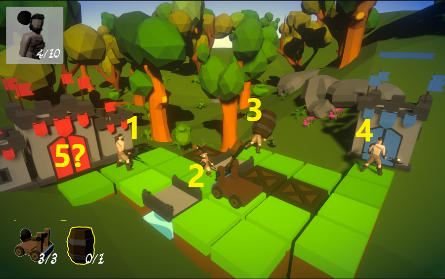

## _**Little Big Tips**_  > Patterns / Algorithms > object pool pattern

> 

Feel free to try this behaviour on the playable demonstration / prototype: [Realm Defender](https://simmer.io/@alissin/realm-defender).<br/>
<sub>_Note:_ The purpose of this demonstration is to evaluate this gameplay mechanic. The scenario and the props are free assets from the Asset Store.</sub>

#### Problem description
It's necessary to spawn infinite enemy warriors in a specific time interval. You could use `Instantiate()` and `Destroy()` methods to spawn / destroy them but it is not a good practice because it has a high cost in performance. Imagine a game with different waves of enemies for example.

#### Solution simplified concept
Instead, you can load (instantiate) a pool of objects at the beginning, recycle them and use them whenever you want, as many as you want.

#### Solution suggestion
In this case, in this level, an object pool with size of 5 objects was enough because this level is small and has a max of 4 warriors simultaneously walking through the path. Just increase the pool size for bigger levels and longer paths.

In the hierarchy, create a game object and name it as `Spawn Controller`:<br/>
<sub>_Note:_ It will be like a container to all instantiated game objects (warriors) that will stay nested (as a child) to this game object.</sub>

```
Hierarchy:
- Spawn Controller
```

Create a C# script `SpawnController.cs` and attach this script to the `Spawn Controller` game object:

```csharp
public class SpawnController : MonoBehaviour
{
    ...
```

Define the fields:

```csharp
[SerializeField]
GameObject spawnPrefab;

[SerializeField]
float spawnDelay;

[SerializeField]
int poolSize;

GameObject[] poolObjs;

int currentPoolSize;
```

When your level is loaded, init the object pool:

```csharp
void InitPool()
{
    currentPoolSize = poolSize;
    poolObjs = new GameObject[currentPoolSize];

    for (int i = 0; i < poolObjs.Length; i++)
    {
        GameObject itemClone = Instantiate(spawnPrefab, transform);
        itemClone.SetActive(false);
        poolObjs[i] = itemClone;
    }
}
```

Cool! At this time, we already have all game objects instantiated and ready to use.<br/>
You can use a spawn mechanism of your choice. In this case, a Coroutine will be used.

Let's spawn some enemies (get objects from pool):

```csharp
IEnumerator SpawnRoutine(Vector3 spawnPos, Quaternion spawnRot)
{
    while (true)
    {
        GetObjFromPool(spawnPos, spawnRot);
        yield return new WaitForSeconds(spawnDelay);
    }
}

GameObject GetObjFromPool(Vector3 spawnPos, Quaternion spawnRot)
{
    // if there is no more available items in the pool, do nothing
    if (currentPoolSize == 0)
    {
        return null;
    }

    currentPoolSize--;

    GameObject obj = poolObjs[currentPoolSize];
    poolObjs[currentPoolSize] = null;

    obj.transform.position = spawnPos;
    obj.transform.rotation = spawnRot;
    obj.SetActive(true);

    return obj;
}
```

Once we are done with the object, we need to return it to the pool:

```csharp
public void ReturnObjToPool(GameObject obj)
{
    obj.SetActive(false);

    poolObjs[currentPoolSize] = obj;
    currentPoolSize++;
}
```

You can see here that we use the array to control which object is available and the `SetActive()` method to actually "use" the object. It is important in this case because there is no need to keep the object `active == true` when we are not using it.

Create the `Enemy` game object on hierarchy, create a C# script `Enemy.cs` and attach this script to the `Enemy` game object and finally create the `Enemy Prefab`. Don't forget to set the field `spawnPrefab` on `Spawn Controller` game object via inspector.

In the `Enemy.cs` script, call this `OnHide()` method when you do not need the object anymore and want to return it to the object pool. In this case, the warrior is hidden when it gets to the player base (blue castle):

```csharp
public void OnHide()
{
    // reset the object default position
    transform.position = defaultPos;

    // TODO: you will need a reference of the `Spawn Controller` script
    spawnController.ReturnObjToPool(gameObject);
}
```

<sub>_Note:_ To keep this example simple and focused on the object pool mechanism, it's up to you to decide how to get the reference of `Spawn Controller` script. You could use `FindObjectOfType<SpawnController>()` but I suggest the observer pattern, callback mechanism like an `Event` / `Action` or even the [singleton pattern](../singleton) with a global access on this spawner mechanism.</sub>

#### Scripts:
[SpawnController.cs](./SpawnController.cs), [Enemy.cs](./Enemy.cs)

Again, feel free to try the behaviour of this _**Little Big Tip**_ on [Realm Defender](https://simmer.io/@alissin/realm-defender).

More _**Little Big Tips**_? Nice, [let's go](https://github.com/alissin/little-big-tips)!