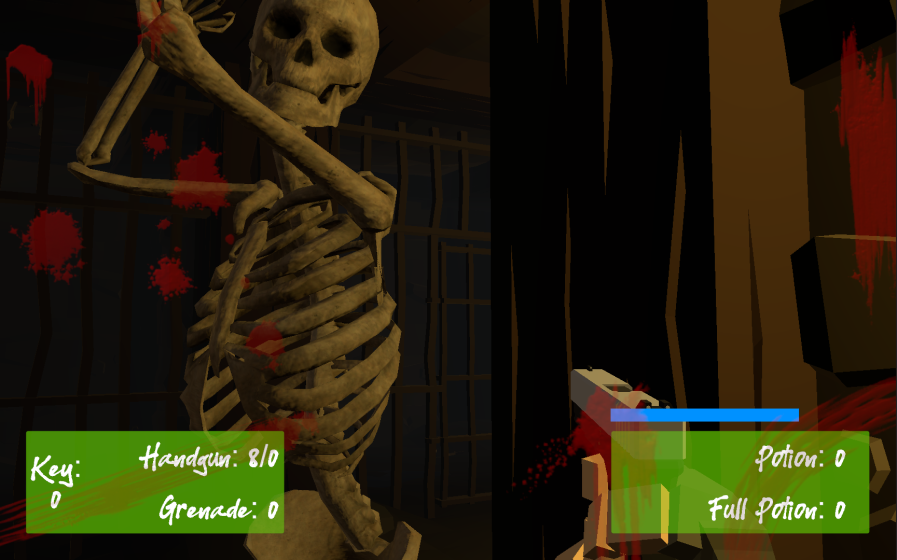

## _**Little Big Tips**_  > Patterns / Algorithms > state pattern

> 

Feel free to try this behaviour on the playable demonstration / prototype: [The Dungeon](https://simmer.io/@alissin/the-dungeon).<br/>
<sub>_Note:_ The purpose of this demonstration is to evaluate this gameplay mechanic. The FPS shooter gameplay mechanic itself, the scenario and the props are free assets from the Asset Store.</sub>

#### Problem description
How to deal with so many states of the enemy skeleton? For example, if the current state is walk, which state could be the next one? How they are related with each other? As a classic example (not this case), if the character is jumping, how to avoid the crouch of the character in the air?

Well, we could use a `switch` case to deal with it. But, imagine how many variables and flags we are supposed to have in our class to control it...

#### Solution simplified concept
Based on the _finite state machines_ (or _"FSMs"_) concept, this pattern has each state implemented as an individual and separated class. It makes your code much more clear, organized and easier to deal with.

#### Solution suggestion
In this case, our enemy skeleton has the following states: Resurrection, Idle, Hit, Walk, Attack and Death.<br/>
<sub>_Note:_ To keep this example simple, we will implement only 3 states: Idle, Walk, Attack. After that, you will get the idea and will be able to implement the other states with no problem.</sub>

In the hierarchy, create a game object and name it as `Enemy`:

```
Hierarchy:
- Enemy
```

Create a C# script `EnemyStateController.cs` and attach this script to the `Enemy` game object:<br/>
<sub>_Note:_ In this case, I'm using the `NavMesh` system. So make sure to bake the navigation, attach an `Animator` and an `NavMeshAgent` components to the `Enemy` game object.</sub>

```csharp
public class EnemyStateController : MonoBehaviour
{
    ...
```

Create a C# script `IEnemyState.cs`. This will be our interface which each state (class) will implement:

```csharp
public interface IEnemyState
{
    void Start(EnemyStateController enemyController);

    IEnemyState Update();
}
```

Create the class of each state and implement the `IEnemyState.cs` interface. You can use the same file (`IEnemyState.cs`):

```csharp
public interface IEnemyState
{
    ...
}

public class IdleState : IEnemyState
{
    public void Start(EnemyStateController enemyController)
    {
        // TODO: implement
    }

    public IEnemyState Update()
    {
        // TODO: implement
        return null;
    }
}

public class WalkState : IEnemyState {

    public void Start(EnemyStateController enemyController)
    {
        // TODO: implement
    }

    public IEnemyState Update()
    {
        // TODO: implement
        return null;
    }
}

public class AttackState : IEnemyState
{
    public void Start(EnemyStateController enemyController)
    {
        // TODO: implement
    }

    public IEnemyState Update()
    {
        // TODO: implement
        return null;
    }
}
```

In the `EnemyStateController.cs` script, define the fields and properties:

```csharp
IEnemyState state;

Animator animator;
public Animator Animator
{
    get => animator;
}

NavMeshAgent navMeshAgent;
public NavMeshAgent NavMeshAgent
{
    get => navMeshAgent;
}
```

The `state` field will be responsible to keep the current state.

Now, let's start the process:

```csharp
void Start()
{
    animator = GetComponent<Animator>();
    navMeshAgent = GetComponent<NavMeshAgent>();

    state = new IdleState();
    state.Start(this);
}
```

And here is how this system works:

```csharp
void Update()
{
    IEnemyState newState = state.Update();
    if (newState != null)
    {
        state = newState;
        state.Start(this);
    }
}
```

As you can see, when the `state.Update()` method returns a new state, the current state is changed. The `state.Start()` method is like a "setup" or "pre-settings" method of the state.

Let's implement our first state:

```csharp
public class IdleState : IEnemyState
{
    EnemyStateController enemyController;
    RaycastHit hit;
    float distance = 5.0f;

    public void Start(EnemyStateController enemyController)
    {
        this.enemyController = enemyController;
    }

    public IEnemyState Update()
    {
        // check if the Player was seen, via raycast for example
        Ray ray = new Ray(enemyController.transform.position, enemyController.transform.forward);
        Debug.DrawRay(ray.origin, ray.direction * distance, Color.yellow);
        if (Physics.Raycast(ray, out _hit, distance))
        {
            if (hit.transform.CompareTag("Player"))
            {
                return new WalkState();
            }
        }
        return null;
    }
}
```

<sub>_Note:_ To keep this example simple and focused on the state mechanism, the `Enemy` is looking directly to its front. The [raycast patrol detection](../../general-tips/raycast-patrol-detection) can help to make it more interesting.</sub>

The `IdleState` keeps the `Enemy` patrolling and when the `Player` comes close, it changes the state to the `WalkState`.

Let's implement the `WalkState`:

```csharp
public class WalkState : IEnemyState
{
    EnemyStateController enemyController;

    public void Start(EnemyStateController enemyController)
    {
        this.enemyController = enemyController;
    }

    public IEnemyState Update()
    {
        // TODO: get access to the Player position
        enemyController.NavMeshAgent.SetDestination(GameManager.Instance.Player.transform.position);
        // in this case, I'm using the Blend Tree to control the animations of the Enemy
        enemyController.Animator.SetFloat("Speed", enemyController.NavMeshAgent.velocity.magnitude);

        // if the distance of the Enemy and the Player is less than the radius + stoppingDistance of the NavMeshAgent, start the attack!
        if (Vector3.Distance(GameManager.Instance.Player.transform.position, enemyController.transform.position) <= (enemyController.NavMeshAgent.stoppingDistance + enemyController.NavMeshAgent.radius))
        {
            return new AttackState();
        }
        
        return null;
    }
}
```

<sub>_Note:_ In this case, I'm using the [singleton pattern](../singleton) to access the `Player` position. With the `NavMesh` system and the `NavMeshAgent`, we can set the direction of the agent and make it move.</sub>

Finally, let's implement the `AttackState`:

```csharp
public class AttackState : IEnemyState {

    EnemyStateController enemyController;
    float rotationSpeed = 5.0f;

    public void Start(EnemyStateController enemyController)
    {
        enemyController = enemyController;
        enemyController.Animator.SetTrigger("Attack");
    }

    public IEnemyState Update()
    {
        // to face the Player smoothly on attack:

        // TODO: get access to the Player position
        Vector3 attackDirection = (GameManager.Instance.Player.transform.position - enemyController.transform.position).normalized;
        // in this case, we don't want to affect the Y rotation, we only care about the direction from X and Z
        Quaternion lookRotation = Quaternion.LookRotation(new Vector3(attackDirection.x, 0, attackDirection.z));
        enemyController.transform.rotation = Quaternion.Slerp(enemyController.transform.rotation, lookRotation, Time.deltaTime * rotationSpeed);

        // in this case, I'm using the Blend Tree to control the animations of the Enemy. Check if the animation is NOT the Attack animation
        if (enemyController.animator.GetCurrentAnimatorStateInfo(0).IsName("Blend Tree"))
        {
            return new WalkState();
        }
        
        return null;
    }
}
```

As you can see, I'm using the `Animator` to control the current animation from the `Enemy`. So, when the attack animation is finished, the state is changed to the `WalkState` and it tests the distance again. If the `Enemy` is close to the `Player`, it attacks again, otherwise, the mechanism keeps the `WalkState` untill the `Enemy` reachs the `Player`.

#### Scripts:
[EnemyStateController.cs](./EnemyStateController.cs), [IEnemyState.cs](./IEnemyState.cs)

Again, feel free to try the behaviour of this _**Little Big Tip**_ on [The Dungeon](https://simmer.io/@alissin/the-dungeon).

More _**Little Big Tips**_? Nice, [let's go](https://github.com/alissin/little-big-tips)!