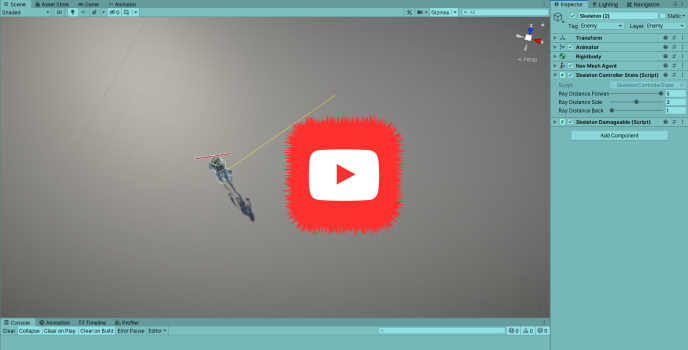

## _**Little Big Tips**_  > General tips > raycast patrol detection

Feel free to try this behaviour on the playable demonstration / prototype: [The Dungeon](https://simmer.io/@alissin/the-dungeon).

_Note_: The purpose of this demonstration is to evaluate this gameplay mechanic. The props are free assets from the Asset Store.

#### Problem description
If the player stays in front of the enemy, of course the player will be seen. But we want to try to go behind the enemy and hit it with a stealth attack. We could be use a raycast with a ray pointing directly to the player instance to achieve this behaviour. But in this case, all enemies should have a reference to the player instance and the calculation would be more difficult because we would need to know if the player is in front or behind our enemy.

#### Solution suggestion
We will implement a raycast with a ray rounding the enemy and if the player comes close, it will be detected. To get it more realistic, we could set a ray with a long distance in front of the enemy but a short one when behind, like so (click to see the behaviour in action):

> [](https://youtu.be/y9Yd5Q0NrgE)

In the hierarchy, create a game object and name it as `Enemy`:

```
Hierarchy:
- Enemy
```

Create a C# script `Enemy.cs` and attach this script to the `Enemy` game object:

```csharp
public class Enemy : MonoBehaviour
{
    ...
```

Define the fields:

```csharp
[SerializeField]
[Range(1.0f, 5.0f)]
float rayDistanceForward = 5.0f;

[SerializeField]
[Range(1.0f, 5.0f)]
float rayDistanceSide = 3.0f;

[SerializeField]
[Range(1.0f, 5.0f)]
float rayDistanceBack = 1.0f;

RaycastHit hit;

int layerMaskExceptEnemy;
```

The `layerMaskExceptEnemy` field will be used in our raycast to avoid the collision with the other enemies in the scene, after all, we need to detect the collision with the `Player` only.

Create the coroutine that will be responsible to calculate the direction of the ray rounding our `Enemy`:

```csharp
IEnumerator RaycastTargetRoutine()
{
    float timeOffset = Time.time;
 
    while (true)
    {
        // default init: x = 0 / z = 1
        float frequency = 5.0f; // more than 5 
        float x = Mathf.Round(Mathf.Sin((Time.time - timeOffset) * frequency) * 10) / 10;
        float z = Mathf.Round(Mathf.Sin((Time.time - timeOffset + 1.0f) * frequency) * 10) / 10;
        Vector3 rayDirection = new Vector3(x, 0, z);

        float distance;
        float dotProduct = Vector3.Dot(transform.forward, rayDirection);
        if (dotProduct >= Mathf.Epsilon)
        {
            distance = Mathf.Lerp(rayDistanceSide, rayDistanceForward, dotProduct);
        }
        else
        {
            distance = Mathf.Lerp(rayDistanceSide, rayDistanceBack, -dotProduct); // invert because Lerp runs with 0 to 1
        }

        RaycastTarget(rayDirection, distance);
        yield return null;
    }
}
```

As you can see, we are using the `Vector3.Dot()` and `Mathf.Lerp()` methods to check the current direction of the ray and then calculate the distance.

Then, let's create the method that will draw the ray in the scene view and check the raycast:

```csharp
void RaycastTarget(Vector3 rayDirection, float distance)
{
    Ray ray = new Ray(transform.position, rayDirection);
    Debug.DrawRay(ray.origin, ray.direction * distance, Color.yellow);

    if (Physics.Raycast(ray, out _hit, distance, _layerMaskExceptEnemy))
    {
        // TODO: impl. the Player was seen
    }
}
```

Let's setup our `layerMaskExceptEnemy` and start the coroutine:

```csharp
void Start()
{
    // Bit shift the index of the layer (9 - Enemy) to get a bit mask. This would cast rays only against colliders in layer 9.
    int enemyLayerMask = 1 << 9;

    // But instead we want to collide against everything except layer 9. The ~ operator does this, it inverts a bitmask.
    layerMaskExceptEnemy = ~enemyLayerMask;

    StartCoroutine(RaycastTargetRoutine());
}
```

Cool! Hit play and enjoy with the yellow ray rounding the `Enemy` game object.<br/>
_Note:_ the `Debug.DrawRay()` draws the ray in runtime and we can see it in the scene view (not in the game view).

#### Scripts:
[Enemy.cs](./Enemy.cs)

Again, feel free to try the behaviour of this _**Little Big Tip**_ on [The Dungeon](https://simmer.io/@alissin/the-dungeon).

More _**Little Big Tips**_? Nice, [let's go](https://github.com/alissin/little-big-tips)!