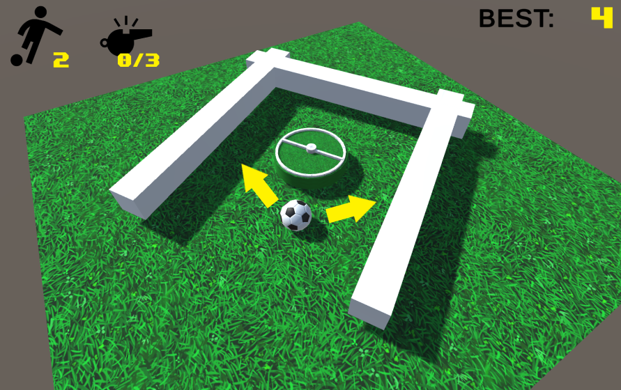

## _**Little Big Tips**_  > General tips > roll the ball

> 

Feel free to try this behaviour on the playable demonstration / prototype: [Goal Dribble](https://simmer.io/@alissin/goal-dribble).<br/>
<sub>_Note_: The purpose of this demonstration is to evaluate this gameplay mechanic. The textures and the sprites are free assets from the Asset Store.</sub>

#### Problem description
In this simple "rolling the ball" mechanic, a.k.a. dribble in this game, how to make the ball rotates around something and on the ground at the same time?

#### Solution suggestion
We will rotate the ball around a point, in this case the center of the field. Then we will rotate the ball on the Z axis to have the effect of rolling on the ground.

In the hierarchy, create a sphere game object and name it as `Player`:

```
Hierarchy:
- Player
```

Make sure to reset the transform of the `Player` game object and then, set the scale (X, Y, Z) to 5 and the position (Z) to 3. To have a better look and feel of the effect, try to find a cool texture in the Asset Store to use on the ball.

Create a C# script `Player.cs` and attach this script to the `Player` game object:

```csharp
public class Player : MonoBehaviour
{
    ...
```

Define the fields:

```csharp
[SerializeField]
float moveSpeed = 200.0f;

[SerializeField]
float rotationFactor = 0.015f;

float lh;
```

Let's start our smart dribble making the ball to rotate around something. In this case, the center point of the scene (`Vector3.zero`):<br/>
<sub>_Note:_ that's why we set the `Player` game object Z position to 3.</sub>

```csharp
void Update ()
{
    lh = Input.GetAxis("Horizontal");

    transform.RotateAround(Vector3.zero, Vector3.up, lh * Time.deltaTime * moveSpeed);
}
```

Now, let's roll the ball to have a stylish dribble:

```csharp
void Update ()
{
    ...

    float rotation = rotationFactor * moveSpeed;
    transform.Rotate(Vector3.forward, -lh * Time.deltaTime * moveSpeed * rotation);
}
```

#### Scripts:
[Player.cs](./Player.cs)

Again, feel free to try the behaviour of this _**Little Big Tip**_ on [Goal Dribble](https://simmer.io/@alissin/goal-dribble).

More _**Little Big Tips**_? Nice, [let's go](https://github.com/alissin/little-big-tips)!