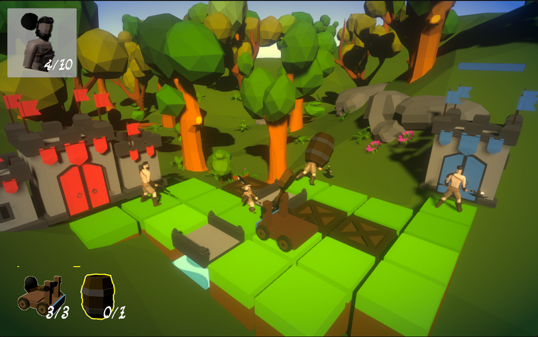

## _**Little Big Tips**_  > General tips > simple cooldown

Feel free to try this behaviour on the playable demonstration / prototype: [Realm Defender](https://simmer.io/@alissin/realm-defender).

_Note_: The purpose of this demonstration is to evaluate this gameplay mechanic. The scenario and the props are free assets from the Asset Store.

> 

#### Problem description
We can use only 3 weapons (catapults in this case) at each time. So, a cooldown system to reload theses weapons will be used to bring a challenge to the player.

#### Solution suggestion
In this case, it was used a simple `UI Slider` to show this effect on the screen. You can use whatever you want.<br/>
_Note_: The scope of this _**Little Big Tip**_ is only the cooldown implementation.

In the hierarchy, create an `UI Slider` game object:<br/>
_Note_: An `UI Canvas` and an `EventSystem` game objects will be created automatically. Leave them there.

```
Hierarchy:
- Canvas
-- Slider
- EventSystem
```

Place the `Slider` wherever you want on the screen. Change the `Max Value` to 10 via inspector.

Create a C# script `Cooldown.cs` and attach this script to the `Slider` game object:

```csharp
public class Cooldown : MonoBehaviour
{
    ...
```

Define the fields:

```csharp
[SerializeField]
float cooldown = 5.0f;

Slider cooldownSlider;

int availableItems = 3;
int maxItems = 3;
bool isCooldownOn = false;
```

Don't forget to use the `UnityEngine.UI` namespace:

```csharp
using UnityEngine.UI;
```

Get the `Slider` component:

```csharp
void Start()
{
    cooldownSlider = GetComponent<Slider>();
}
```

As you can see, we have 3 items set on `maxItems` field and the cooldown system will run until all of them are reloaded. The `cooldown` field is set to 5.0f, that means 5 seconds to reload each item:

```csharp
void Update()
{
    if (isCooldownOn)
    {
        cooldownSlider.value += Time.deltaTime / cooldown;

        if (cooldownSlider.value >= cooldownSlider.maxValue)
        {
            availableItems++;
            cooldownSlider.value = 0.0f;
        }

        isCooldownOn = availableItems < maxItems;
    }
}
```

Let's simulate when the player uses the items:<br/>
_Note:_ this will use the 3 items at the same time, just to see the cooldown in action.

```csharp
void Update()
{
    ...

    if (Input.GetKeyDown(KeyCode.Space))
    {
        availableItems = 0;
        isCooldownOn = true;
    }
}
```

#### Scripts:
[Cooldown.cs](./Cooldown.cs)

Again, feel free to try the behaviour of this _**Little Big Tip**_ on [Realm Defender](https://simmer.io/@alissin/realm-defender).

More _**Little Big Tips**_? Nice, [let's go](https://github.com/alissin/little-big-tips)!