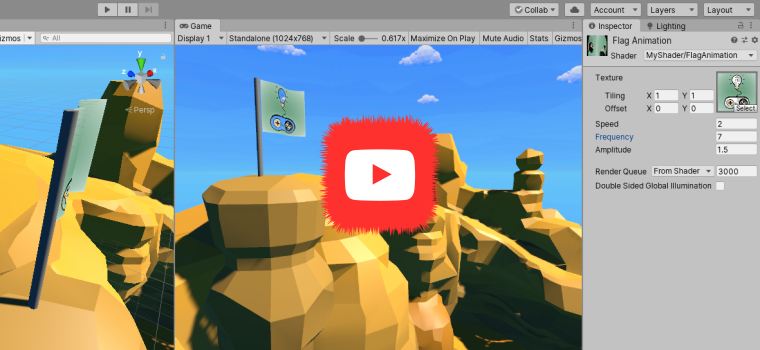
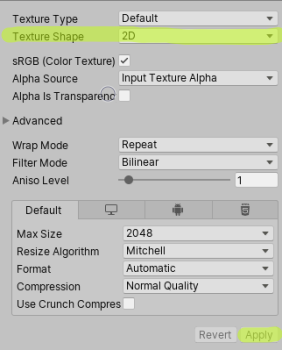
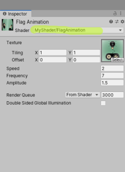

## _**Little Big Tips**_  > VFX - Shaders > flag animation shader

> [](https://youtu.be/ciC5yaOy-S0)

Click to see this VFX in action.<br/>
<sub>_Note:_ The purpose of this demonstration is to evaluate this VFX. The scenario and the props are free assets from the Asset Store.</sub>

#### Problem description
How to simulate a simple wind effect on our flag?

#### Solution suggestion
We will write our own shader using cg language. So, we will be able to add some animation on the normal direction (Y vector) of a `Plane` mesh.<br/>
<sub>_Note:_ as this shader animates the normal vertices, make sure to have a high poly mesh.</sub>

Create an empty file and name it `FlagAnimation.shader`.

Create the base structure of our shader file:

```
Shader "MyShader/FlagAnimation" {

    Properties {

    }

    SubShader {

        Pass {

            CGPROGRAM
            
            ENDCG
        }
    }
}
```

As you can see, we have all the base code blocks for a basic cg language shader.

Define the `Properties`:

```
Properties {    
    _Tex ("Texture", 2D) = "white" {}
    _Speed ("Speed", Float) = 1.0
    _Frequency ("Frequency", Float) = 1.0
    _Amplitude ("Amplitude", Float) = 1.0
}
```

Inside the `CGPROGRAM` block, let's declare the main functions and properties:

```
CGPROGRAM

#pragma vertex vert
#pragma fragment frag

uniform sampler2D _Tex;
uniform float4 _Tex_ST;
uniform float _Speed;
uniform float _Frequency;
uniform float _Amplitude;

ENDCG
```

Now, the input and output:<br/>
<sub>_Note:_ below the code of step 3.</sub>

```
CGPROGRAM

...

struct input {
    float4 position : POSITION;
    float4 texcoord : TEXCOORD0;
};

struct output {
    float4 position : SV_POSITION;
    float4 texcoord : TEXCOORD0;
};

ENDCG
```

Finally, the vertex shader and fragment shader functions. We will use the math sin function to animate and simulate the "bounce" of the vertices. In this case, we are changing only the Y vector of the mesh:<br/>
<sub>_Note:_ below the code of step 4.</sub>

```
CGPROGRAM

...

output vert(input i) {
    i.position.y += sin((i.texcoord.x - _Time.y * _Speed) * _Frequency) * (i.texcoord.x * _Amplitude);

    output o;
    UNITY_INITIALIZE_OUTPUT(output, o);
    o.position = UnityObjectToClipPos(i.position);
    o.texcoord.xy = (i.texcoord.xy * _Tex_ST.xy + _Tex_ST.zw);
    return o;
}

half4 frag(output o) : COLOR {
    return tex2D(_Tex, o.texcoord);
}

ENDCG
```

As you can see, only one side of the `Plane` surface is visible. Our shader can help us with this:

```
Pass {
    Cull Off

    CGPROGRAM
    ...
```

Find a very cool 2D texture in the Asset Store and don't forget to set the texture shape as `2D` and apply:

> 

Create a material, change it to use our shader, select your texture and finally attach this material to the `Plane` mesh:

> 

Again, feel free to see this VFX in action [here](https://youtu.be/ciC5yaOy-S0).

More _**Little Big Tips**_? Nice, [let's go](https://github.com/alissin/little-big-tips)!